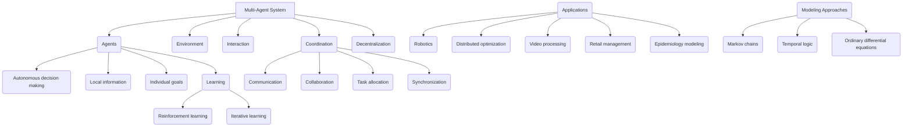

# AMI-ML-Techniques

AMI - Advanced Machine Intelligence

# Mermaid Models of MAS, MOE, SRSB, MMFM
## 1. Multi-agent Systems (MAS) - Solve by swarm of agents


## 2. Mixture of Experts (MOE) - Solve by named experts
## 3. SRSB - Self reward score battles
## 4. MMFM - Memory model feedback maker

# Mermaid Prompt:
```python
Create a Mermaid Model which creates a diagram and model with short descriptions of common entities and method steps drawn from the papers and summary below for Multi-agent Systems (MAS):
```

# 1. Multi-agent Systems (MAS)

```python

# 🩺🔍 Search Results
### 30 Nov 2011 | [Stability of Evolving Multi-Agent Systems](https://arxiv.org/abs/1111.7033) | [⬇️](https://arxiv.org/pdf/1111.7033)
*Philippe De Wilde and Gerard Briscoe* 

  A Multi-Agent System is a distributed system where the agents or nodes
perform complex functions that cannot be written down in analytic form.
Multi-Agent Systems are highly connected, and the information they contain is
mostly stored in the connections. When agents update their state, they take
into account the state of the other agents, and they have access to those
states via the connections. There is also external, user-generated input into
the Multi-Agent System. As so much information is stored in the connections,
agents are often memory-less. This memory-less property, together with the
randomness of the external input, has allowed us to model Multi-Agent Systems
using Markov chains. In this paper, we look at Multi-Agent Systems that evolve,
i.e. the number of agents varies according to the fitness of the individual
agents. We extend our Markov chain model, and define stability. This is the
start of a methodology to control Multi-Agent Systems. We then build upon this
to construct an entropy-based definition for the degree of instability (entropy
of the limit probabilities), which we used to perform a stability analysis. We
then investigated the stability of evolving agent populations through
simulation, and show that the results are consistent with the original
definition of stability in non-evolving Multi-Agent Systems, proposed by Chli
and De Wilde. This paper forms the theoretical basis for the construction of
Digital Business Ecosystems, and applications have been reported elsewhere.

---------------

### 11 Jan 2018 | [Distributed Constraint Optimization Problems and Applications: A Survey](https://arxiv.org/abs/1602.06347) | [⬇️](https://arxiv.org/pdf/1602.06347)
*Ferdinando Fioretto, Enrico Pontelli, William Yeoh* 

  The field of Multi-Agent System (MAS) is an active area of research within
Artificial Intelligence, with an increasingly important impact in industrial
and other real-world applications. Within a MAS, autonomous agents interact to
pursue personal interests and/or to achieve common objectives. Distributed
Constraint Optimization Problems (DCOPs) have emerged as one of the prominent
agent architectures to govern the agents' autonomous behavior, where both
algorithms and communication models are driven by the structure of the specific
problem. During the last decade, several extensions to the DCOP model have
enabled them to support MAS in complex, real-time, and uncertain environments.
This survey aims at providing an overview of the DCOP model, giving a
classification of its multiple extensions and addressing both resolution
methods and applications that find a natural mapping within each class of
DCOPs. The proposed classification suggests several future perspectives for
DCOP extensions, and identifies challenges in the design of efficient
resolution algorithms, possibly through the adaptation of strategies from
different areas.

---------------

### 01 Jun 2011 | [Decentralized Markets versus Central Control: A Comparative Study](https://arxiv.org/abs/1106.0223) | [⬇️](https://arxiv.org/pdf/1106.0223)
*H. Akkermans, F. Ygge* 

  Multi-Agent Systems (MAS) promise to offer solutions to problems where
established, older paradigms fall short. In order to validate such claims that
are repeatedly made in software agent publications, empirical in-depth studies
of advantages and weaknesses of multi-agent solutions versus conventional ones
in practical applications are needed. Climate control in large buildings is one
application area where multi-agent systems, and market-oriented programming in
particular, have been reported to be very successful, although central control
solutions are still the standard practice. We have therefore constructed and
implemented a variety of market designs for this problem, as well as different
standard control engineering solutions. This article gives a detailed analysis
and comparison, so as to learn about differences between standard versus agent
approaches, and yielding new insights about benefits and limitations of
computational markets. An important outcome is that "local information plus
market communication produces global control".

---------------

### 03 Dec 2019 | [A Dataset Schema for Cooperative Learning from Demonstration in  Multi-robots Systems](https://arxiv.org/abs/1912.01741) | [⬇️](https://arxiv.org/pdf/1912.01741)
*Marco A. C. Sim\~oes, Robson Marinho da Silva and Tatiane Nogueira* 

  Multi-Agent Systems (MASs) have been used to solve complex problems that
demand intelligent agents working together to reach the desired goals. These
Agents should effectively synchronize their individual behaviors so that they
can act as a team in a coordinated manner to achieve the common goal of the
whole system. One of the main issues in MASs is the agents' coordination, being
common domain experts observing MASs execution disapprove agents' decisions.
Even if the MAS was designed using the best methods and tools for agents'
coordination, this difference of decisions between experts and MAS is
confirmed. Therefore, this paper proposes a new dataset schema to support
learning the coordinated behavior in MASs from demonstration. The results of
the proposed solution are validated in a Multi-Robot System (MRS) organizing a
collection of new cooperative plans recommendations from the demonstration by
domain experts.

---------------

### 02 Mar 2023 | [Planning and Control of Uncertain Cooperative Mobile Manipulator-Endowed  Systems under Temporal-Logic Tasks](https://arxiv.org/abs/2303.01379) | [⬇️](https://arxiv.org/pdf/2303.01379)
*Christos Verginis* 

  Control and planning of multi-agent systems is an active and increasingly
studied topic of research, with many practical applications such as rescue
missions, security, surveillance, and transportation. This thesis addresses the
planning and control of multi-agent systems under temporal logic tasks. The
considered systems concern complex, robotic, manipulator-endowed systems, which
can coordinate in order to execute complicated tasks, including object
manipulation/transportation. Motivated by real-life scenarios, we take into
account high-order dynamics subject to model uncertainties and unknown
disturbances. Our approach is based on the integration of tools from the areas
of multi-agent systems, intelligent control theory, cooperative object
manipulation, discrete abstraction design of multi-agent-object systems, and
formal verification. The first part of the thesis is devoted to the design of
continuous control protocols for cooperative object manipulation/transportation
by multiple robotic agents, and the relation of rigid cooperative manipulation
schemes to multi-agent formation. In the second part of the thesis, we develop
control schemes for the continuous coordination of multi-agent complex systems
with uncertain dynamics, focusing on multi-agent navigation with collision
specifications in obstacle-cluttered environments. The third part of the thesis
is focused on the planning and control of multi-agent and multi-agent-object
systems subject to complex tasks expressed as temporal logic formulas. The
fourth and final part of the thesis focuses on several extension schemes for
single-agent setups, such as motion planning under timed temporal tasks and
asymptotic reference tracking for unknown systems while respecting funnel
constraints.

---------------

### 19 Dec 2023 | [TESS: A Multi-intent Parser for Conversational Multi-Agent Systems with  Decentralized Natural Language Understanding Models](https://arxiv.org/abs/2312.11828) | [⬇️](https://arxiv.org/pdf/2312.11828)
*Burak Aksar, Yara Rizk and Tathagata Chakraborti* 

  Chatbots have become one of the main pathways for the delivery of business
automation tools. Multi-agent systems offer a framework for designing chatbots
at scale, making it easier to support complex conversations that span across
multiple domains as well as enabling developers to maintain and expand their
capabilities incrementally over time. However, multi-agent systems complicate
the natural language understanding (NLU) of user intents, especially when they
rely on decentralized NLU models: some utterances (termed single intent) may
invoke a single agent while others (termed multi-intent) may explicitly invoke
multiple agents. Without correctly parsing multi-intent inputs, decentralized
NLU approaches will not achieve high prediction accuracy. In this paper, we
propose an efficient parsing and orchestration pipeline algorithm to service
multi-intent utterances from the user in the context of a multi-agent system.
Our proposed approach achieved comparable performance to competitive deep
learning models on three different datasets while being up to 48 times faster.

---------------

### 06 Sep 2019 | [Multi-Objective Multi-Agent Decision Making: A Utility-based Analysis  and Survey](https://arxiv.org/abs/1909.02964) | [⬇️](https://arxiv.org/pdf/1909.02964)
*Roxana R\u{a}dulescu, Patrick Mannion, Diederik M. Roijers, Ann Now\'e* 

  The majority of multi-agent system (MAS) implementations aim to optimise
agents' policies with respect to a single objective, despite the fact that many
real-world problem domains are inherently multi-objective in nature.
Multi-objective multi-agent systems (MOMAS) explicitly consider the possible
trade-offs between conflicting objective functions. We argue that, in MOMAS,
such compromises should be analysed on the basis of the utility that these
compromises have for the users of a system. As is standard in multi-objective
optimisation, we model the user utility using utility functions that map value
or return vectors to scalar values. This approach naturally leads to two
different optimisation criteria: expected scalarised returns (ESR) and
scalarised expected returns (SER). We develop a new taxonomy which classifies
multi-objective multi-agent decision making settings, on the basis of the
reward structures, and which and how utility functions are applied. This allows
us to offer a structured view of the field, to clearly delineate the current
state-of-the-art in multi-objective multi-agent decision making approaches and
to identify promising directions for future research. Starting from the
execution phase, in which the selected policies are applied and the utility for
the users is attained, we analyse which solution concepts apply to the
different settings in our taxonomy. Furthermore, we define and discuss these
solution concepts under both ESR and SER optimisation criteria. We conclude
with a summary of our main findings and a discussion of many promising future
research directions in multi-objective multi-agent systems.

---------------

### 20 Jul 2021 | [Collaborative Visual Navigation](https://arxiv.org/abs/2107.01151) | [⬇️](https://arxiv.org/pdf/2107.01151)
*Haiyang Wang, Wenguan Wang, Xizhou Zhu, Jifeng Dai, Liwei Wang* 

  As a fundamental problem for Artificial Intelligence, multi-agent system
(MAS) is making rapid progress, mainly driven by multi-agent reinforcement
learning (MARL) techniques. However, previous MARL methods largely focused on
grid-world like or game environments; MAS in visually rich environments has
remained less explored. To narrow this gap and emphasize the crucial role of
perception in MAS, we propose a large-scale 3D dataset, CollaVN, for
multi-agent visual navigation (MAVN). In CollaVN, multiple agents are entailed
to cooperatively navigate across photo-realistic environments to reach target
locations. Diverse MAVN variants are explored to make our problem more general.
Moreover, a memory-augmented communication framework is proposed. Each agent is
equipped with a private, external memory to persistently store communication
information. This allows agents to make better use of their past communication
information, enabling more efficient collaboration and robust long-term
planning. In our experiments, several baselines and evaluation metrics are
designed. We also empirically verify the efficacy of our proposed MARL approach
across different MAVN task settings.

---------------

### 29 Feb 2024 | [Causal Graph ODE: Continuous Treatment Effect Modeling in Multi-agent  Dynamical Systems](https://arxiv.org/abs/2403.00178) | [⬇️](https://arxiv.org/pdf/2403.00178)
*Zijie Huang, Jeehyun Hwang, Junkai Zhang, Jinwoo Baik, Weitong Zhang,  Dominik Wodarz, Yizhou Sun, Quanquan Gu, Wei Wang* 

  Real-world multi-agent systems are often dynamic and continuous, where the
agents co-evolve and undergo changes in their trajectories and interactions
over time. For example, the COVID-19 transmission in the U.S. can be viewed as
a multi-agent system, where states act as agents and daily population movements
between them are interactions. Estimating the counterfactual outcomes in such
systems enables accurate future predictions and effective decision-making, such
as formulating COVID-19 policies. However, existing methods fail to model the
continuous dynamic effects of treatments on the outcome, especially when
multiple treatments (e.g., "stay-at-home" and "get-vaccine" policies) are
applied simultaneously. To tackle this challenge, we propose Causal Graph
Ordinary Differential Equations (CAG-ODE), a novel model that captures the
continuous interaction among agents using a Graph Neural Network (GNN) as the
ODE function. The key innovation of our model is to learn time-dependent
representations of treatments and incorporate them into the ODE function,
enabling precise predictions of potential outcomes. To mitigate confounding
bias, we further propose two domain adversarial learning-based objectives,
which enable our model to learn balanced continuous representations that are
not affected by treatments or interference. Experiments on two datasets (i.e.,
COVID-19 and tumor growth) demonstrate the superior performance of our proposed
model.

---------------

### 18 Sep 2019 | [Memory Management in Resource-Bounded Agents](https://arxiv.org/abs/1909.09454) | [⬇️](https://arxiv.org/pdf/1909.09454)
*Valentina Pitoni (University of L'Aquila)* 

  In artificial intelligence, multi agent systems constitute an interesting
typology of society modeling, and have in this regard vast fields of
application, which extend to the human sciences. Logic is often used to model
such kind of systems as it is easier to verify the explainability and
validation, so for this reason we have tried to manage agents' memory extending
a previous work by inserting the concept of time.

---------------

### 27 Dec 2022 | [Learning Individual Policies in Large Multi-agent Systems through Local  Variance Minimization](https://arxiv.org/abs/2212.13379) | [⬇️](https://arxiv.org/pdf/2212.13379)
*Tanvi Verma, Pradeep Varakantham* 

  In multi-agent systems with large number of agents, typically the
contribution of each agent to the value of other agents is minimal (e.g.,
aggregation systems such as Uber, Deliveroo). In this paper, we consider such
multi-agent systems where each agent is self-interested and takes a sequence of
decisions and represent them as a Stochastic Non-atomic Congestion Game (SNCG).
We derive key properties for equilibrium solutions in SNCG model with
non-atomic and also nearly non-atomic agents. With those key equilibrium
properties, we provide a novel Multi-Agent Reinforcement Learning (MARL)
mechanism that minimizes variance across values of agents in the same state. To
demonstrate the utility of this new mechanism, we provide detailed results on a
real-world taxi dataset and also a generic simulator for aggregation systems.
We show that our approach reduces the variance in revenues earned by taxi
drivers, while still providing higher joint revenues than leading approaches.

---------------

### 14 Sep 2022 | [An ensemble Multi-Agent System for non-linear classification](https://arxiv.org/abs/2209.06824) | [⬇️](https://arxiv.org/pdf/2209.06824)
*Thibault Fourez (IRIT-SMAC), Nicolas Verstaevel (IRIT-SMAC),  Fr\'ed\'eric Migeon (IRIT-SMAC), Fr\'ed\'eric Schettini, Frederic Amblard  (IRIT-SMAC)* 

  Self-Adaptive Multi-Agent Systems (AMAS) transform machine learning problems
into problems of local cooperation between agents. We present smapy, an
ensemble based AMAS implementation for mobility prediction, whose agents are
provided with machine learning models in addition to their cooperation rules.
With a detailed methodology, we show that it is possible to use linear models
for nonlinear classification on a benchmark transport mode detection dataset,
if they are integrated in a cooperative multi-agent structure. The results
obtained show a significant improvement of the performance of linear models in
non-linear contexts thanks to the multi-agent approach.

---------------

### 25 Nov 2021 | [Collective Iterative Learning Control: Exploiting Diversity in  Multi-Agent Systems for Reference Tracking Tasks](https://arxiv.org/abs/2104.07620) | [⬇️](https://arxiv.org/pdf/2104.07620)
*Michael Meindl, Fabio Molinari, Dustin Lehmann, Thomas Seel* 

  Multi-agent systems (MASs) can autonomously learn to solve previously unknown
tasks by means of each agent's individual intelligence as well as by
collaborating and exploiting collective intelligence. This article considers a
group of autonomous agents learning to track the same given reference
trajectory in a possibly small number of trials. We propose a novel collective
learning control method that combines iterative learning control (ILC) with a
collective update strategy. We derive conditions for desirable convergence
properties of such systems. We show that the proposed method allows the
collective to combine the advantages of the agents' individual learning
strategies and thereby overcomes trade-offs and limitations of single-agent
ILC. This benefit is achieved by designing a heterogeneous collective, i.e., a
different learning law is assigned to each agent. All theoretical results are
confirmed in simulations and experiments with two-wheeled-inverted-pendulum
robots (TWIPRs) that jointly learn to perform the desired maneuver.

---------------

### 06 Sep 2023 | [Multi-agent Coordination Under Temporal Logic Tasks and Team-Wise  Intermittent Communication](https://arxiv.org/abs/2308.14042) | [⬇️](https://arxiv.org/pdf/2308.14042)
*Junjie Wang, Meng Guo and Zhongkui Li* 

  Multi-agent systems outperform single agent in complex collaborative tasks.
However, in large-scale scenarios, ensuring timely information exchange during
decentralized task execution remains a challenge. This work presents an online
decentralized coordination scheme for multi-agent systems under complex local
tasks and intermittent communication constraints. Unlike existing strategies
that enforce all-time or intermittent connectivity, our approach allows agents
to join or leave communication networks at aperiodic intervals, as deemed
optimal by their online task execution. This scheme concurrently determines
local plans and refines the communication strategy, i.e., where and when to
communicate as a team. A decentralized potential game is modeled among agents,
for which a Nash equilibrium is generated iteratively through online local
search. It guarantees local task completion and intermittent communication
constraints. Extensive numerical simulations are conducted against several
strong baselines.

---------------

### 05 Feb 2024 | [LLM Multi-Agent Systems: Challenges and Open Problems](https://arxiv.org/abs/2402.03578) | [⬇️](https://arxiv.org/pdf/2402.03578)
*Shanshan Han, Qifan Zhang, Yuhang Yao, Weizhao Jin, Zhaozhuo Xu,  Chaoyang He* 

  This paper explores existing works of multi-agent systems and identifies
challenges that remain inadequately addressed. By leveraging the diverse
capabilities and roles of individual agents within a multi-agent system, these
systems can tackle complex tasks through collaboration. We discuss optimizing
task allocation, fostering robust reasoning through iterative debates, managing
complex and layered context information, and enhancing memory management to
support the intricate interactions within multi-agent systems. We also explore
the potential application of multi-agent systems in blockchain systems to shed
light on their future development and application in real-world distributed
systems.

---------------

### 19 Mar 2010 | [Modelling and simulating retail management practices: a first approach](https://arxiv.org/abs/1003.3766) | [⬇️](https://arxiv.org/pdf/1003.3766)
*Peer-Olaf Siebers, Uwe Aickelin, Helen Celia, Chris Clegg* 

  Multi-agent systems offer a new and exciting way of understanding the world
of work. We apply agent-based modeling and simulation to investigate a set of
problems in a retail context. Specifically, we are working to understand the
relationship between people management practices on the shop-floor and retail
performance. Despite the fact we are working within a relatively novel and
complex domain, it is clear that using an agent-based approach offers great
potential for improving organizational capabilities in the future. Our
multi-disciplinary research team has worked closely with one of the UK's top
ten retailers to collect data and build an understanding of shop-floor
operations and the key actors in a department (customers, staff, and managers).
Based on this case study we have built and tested our first version of a retail
branch agent-based simulation model where we have focused on how we can
simulate the effects of people management practices on customer satisfaction
and sales. In our experiments we have looked at employee development and
cashier empowerment as two examples of shop floor management practices. In this
paper we describe the underlying conceptual ideas and the features of our
simulation model. We present a selection of experiments we have conducted in
order to validate our simulation model and to show its potential for answering
"what-if" questions in a retail context. We also introduce a novel performance
measure which we have created to quantify customers' satisfaction with service,
based on their individual shopping experiences.

---------------

### 24 Nov 2023 | [An Industrial Perspective on Multi-Agent Decision Making for  Interoperable Robot Navigation following the VDA5050 Standard](https://arxiv.org/abs/2311.14615) | [⬇️](https://arxiv.org/pdf/2311.14615)
*Niels van Duijkeren and Luigi Palmieri and Ralph Lange and Alexander  Kleiner* 

  This paper provides a perspective on the literature and current challenges in
Multi-Agent Systems for interoperable robot navigation in industry. The focus
is on the multi-agent decision stack for Autonomous Mobile Robots operating in
mixed environments with humans, manually driven vehicles, and legacy Automated
Guided Vehicles. We provide typical characteristics of such Multi-Agent Systems
observed today and how these are expected to change on the short term due to
the new standard VDA5050 and the interoperability framework OpenRMF. We present
recent changes in fleet management standards and the role of open middleware
frameworks like ROS2 reaching industrial-grade quality. Approaches to increase
the robustness and performance of multi-robot navigation systems for
transportation are discussed, and research opportunities are derived.

---------------

### 18 Sep 2019 | [A Temporal Module for Logical Frameworks](https://arxiv.org/abs/1909.08256) | [⬇️](https://arxiv.org/pdf/1909.08256)
*Valentina Pitoni (University of L'Aquila), Stefania Costantini  (University of L'Aquila)* 

  In artificial intelligence, multi agent systems constitute an interesting
typology of society modeling, and have in this regard vast fields of
application, which extend to the human sciences. Logic is often used to model
such kind of systems as it is easier to verify than other approaches, and
provides explainability and potential validation. In this paper we define a
time module suitable to add time to many logic representations of agents.

---------------

### 27 May 2023 | [Collaborative Multi-Agent Video Fast-Forwarding](https://arxiv.org/abs/2305.17569) | [⬇️](https://arxiv.org/pdf/2305.17569)
*Shuyue Lan, Zhilu Wang, Ermin Wei, Amit K. Roy-Chowdhury and Qi Zhu* 

  Multi-agent applications have recently gained significant popularity. In many
computer vision tasks, a network of agents, such as a team of robots with
cameras, could work collaboratively to perceive the environment for efficient
and accurate situation awareness. However, these agents often have limited
computation, communication, and storage resources. Thus, reducing resource
consumption while still providing an accurate perception of the environment
becomes an important goal when deploying multi-agent systems. To achieve this
goal, we identify and leverage the overlap among different camera views in
multi-agent systems for reducing the processing, transmission and storage of
redundant/unimportant video frames. Specifically, we have developed two
collaborative multi-agent video fast-forwarding frameworks in distributed and
centralized settings, respectively. In these frameworks, each individual agent
can selectively process or skip video frames at adjustable paces based on
multiple strategies via reinforcement learning. Multiple agents then
collaboratively sense the environment via either 1) a consensus-based
distributed framework called DMVF that periodically updates the fast-forwarding
strategies of agents by establishing communication and consensus among
connected neighbors, or 2) a centralized framework called MFFNet that utilizes
a central controller to decide the fast-forwarding strategies for agents based
on collected data. We demonstrate the efficacy and efficiency of our proposed
frameworks on a real-world surveillance video dataset VideoWeb and a new
simulated driving dataset CarlaSim, through extensive simulations and
deployment on an embedded platform with TCP communication. We show that
compared with other approaches in the literature, our frameworks achieve better
coverage of important frames, while significantly reducing the number of frames
processed at each agent.

---------------

### 24 Dec 2022 | [Time Minimization and Online Synchronization for Multi-agent Systems  under Collaborative Temporal Tasks](https://arxiv.org/abs/2208.07756) | [⬇️](https://arxiv.org/pdf/2208.07756)
*Zesen Liu, Meng Guo, Zhongkui Li* 

  Multi-agent systems can be extremely efficient when solving a team-wide task
in a concurrent manner. However, without proper synchronization, the
correctness of the combined behavior is hard to guarantee, such as to follow a
specific ordering of sub-tasks or to perform a simultaneous collaboration. This
work addresses the minimum-time task planning problem for multi-agent systems
under complex global tasks stated as Linear Temporal Logic (LTL) formulas.
These tasks include the temporal and spatial requirements on both independent
local actions and direct sub-team collaborations. The proposed solution is an
anytime algorithm that combines the partial-ordering analysis of the underlying
task automaton for task decomposition, and the branch and bound (BnB) search
method for task assignment. Analyses of its soundness, completeness and
optimality as the minimal completion time are provided. It is also shown that a
feasible and near-optimal solution is quickly reached while the search
continues within the time budget. Furthermore, to handle fluctuations in task
duration and agent failures during online execution, an adaptation algorithm is
proposed to synchronize execution status and re-assign unfinished subtasks
dynamically to maintain correctness and optimality. Both algorithms are
validated rigorously over large-scale systems via numerical simulations and
hardware experiments, against several strong baselines.

---------------
```

# 2. Mixture of Experts (MOE)
```python
# 🩺🔍 Search Results
### 09 Dec 2016 | [Robust mixture of experts modeling using the skew $t$ distribution](https://arxiv.org/abs/1612.06879) | [⬇️](https://arxiv.org/pdf/1612.06879)
*Faicel Chamroukhi* 

  Mixture of Experts (MoE) is a popular framework in the fields of statistics
and machine learning for modeling heterogeneity in data for regression,
classification and clustering. MoE for continuous data are usually based on the
normal distribution. However, it is known that for data with asymmetric
behavior, heavy tails and atypical observations, the use of the normal
distribution is unsuitable. We introduce a new robust non-normal mixture of
experts modeling using the skew $t$ distribution. The proposed skew $t$ mixture
of experts, named STMoE, handles these issues of the normal mixtures experts
regarding possibly skewed, heavy-tailed and noisy data. We develop a dedicated
expectation conditional maximization (ECM) algorithm to estimate the model
parameters by monotonically maximizing the observed data log-likelihood. We
describe how the presented model can be used in prediction and in model-based
clustering of regression data. Numerical experiments carried out on simulated
data show the effectiveness and the robustness of the proposed model in fitting
non-linear regression functions as well as in model-based clustering. Then, the
proposed model is applied to the real-world data of tone perception for musical
data analysis, and the one of temperature anomalies for the analysis of climate
change data. The obtained results confirm the usefulness of the model for
practical data analysis applications.

---------------

### 11 Sep 2023 | [Pushing Mixture of Experts to the Limit: Extremely Parameter Efficient  MoE for Instruction Tuning](https://arxiv.org/abs/2309.05444) | [⬇️](https://arxiv.org/pdf/2309.05444)
*Ted Zadouri, Ahmet \"Ust\"un, Arash Ahmadian, Beyza Ermi\c{s}, Acyr  Locatelli, Sara Hooker* 

  The Mixture of Experts (MoE) is a widely known neural architecture where an
ensemble of specialized sub-models optimizes overall performance with a
constant computational cost. However, conventional MoEs pose challenges at
scale due to the need to store all experts in memory. In this paper, we push
MoE to the limit. We propose extremely parameter-efficient MoE by uniquely
combining MoE architecture with lightweight experts.Our MoE architecture
outperforms standard parameter-efficient fine-tuning (PEFT) methods and is on
par with full fine-tuning by only updating the lightweight experts -- less than
1% of an 11B parameters model. Furthermore, our method generalizes to unseen
tasks as it does not depend on any prior task knowledge. Our research
underscores the versatility of the mixture of experts architecture, showcasing
its ability to deliver robust performance even when subjected to rigorous
parameter constraints. Our code used in all the experiments is publicly
available here: https://github.com/for-ai/parameter-efficient-moe.

---------------

### 04 Sep 2022 | [A non-asymptotic approach for model selection via penalization in  high-dimensional mixture of experts models](https://arxiv.org/abs/2104.02640) | [⬇️](https://arxiv.org/pdf/2104.02640)
*TrungTin Nguyen, Hien Duy Nguyen, Faicel Chamroukhi and Florence  Forbes* 

  Mixture of experts (MoE) are a popular class of statistical and machine
learning models that have gained attention over the years due to their
flexibility and efficiency. In this work, we consider Gaussian-gated localized
MoE (GLoME) and block-diagonal covariance localized MoE (BLoME) regression
models to present nonlinear relationships in heterogeneous data with potential
hidden graph-structured interactions between high-dimensional predictors. These
models pose difficult statistical estimation and model selection questions,
both from a computational and theoretical perspective. This paper is devoted to
the study of the problem of model selection among a collection of GLoME or
BLoME models characterized by the number of mixture components, the complexity
of Gaussian mean experts, and the hidden block-diagonal structures of the
covariance matrices, in a penalized maximum likelihood estimation framework. In
particular, we establish non-asymptotic risk bounds that take the form of weak
oracle inequalities, provided that lower bounds for the penalties hold. The
good empirical behavior of our models is then demonstrated on synthetic and
real datasets.

---------------

### 25 May 2021 | [Mixture of ELM based experts with trainable gating network](https://arxiv.org/abs/2105.11706) | [⬇️](https://arxiv.org/pdf/2105.11706)
*Laleh Armi, Elham Abbasi, Jamal Zarepour-Ahmadabadi* 

  Mixture of experts method is a neural network based ensemble learning that
has great ability to improve the overall classification accuracy. This method
is based on the divide and conquer principle, in which the problem space is
divided between several experts by supervisition of gating network. In this
paper, we propose an ensemble learning method based on mixture of experts which
is named mixture of ELM based experts with trainable gating network (MEETG) to
improve the computing cost and to speed up the learning process of ME. The
structure of ME consists of multi layer perceptrons (MLPs) as base experts and
gating network, in which gradient-based learning algorithm is applied for
training the MLPs which is an iterative and time consuming process. In order to
overcome on these problems, we use the advantages of extreme learning machine
(ELM) for designing the structure of ME. ELM as a learning algorithm for single
hidden-layer feed forward neural networks provides much faster learning process
and better generalization ability in comparision with some other traditional
learning algorithms. Also, in the proposed method a trainable gating network is
applied to aggregate the outputs of the experts dynamically according to the
input sample. Our experimental results and statistical analysis on 11 benchmark
datasets confirm that MEETG has an acceptable performance in classification
problems. Furthermore, our experimental results show that the proposed approach
outperforms the original ELM on prediction stability and classification
accuracy.

---------------

### 28 Jun 2015 | [Non-Normal Mixtures of Experts](https://arxiv.org/abs/1506.06707) | [⬇️](https://arxiv.org/pdf/1506.06707)
*Faicel Chamroukhi* 

  Mixture of Experts (MoE) is a popular framework for modeling heterogeneity in
data for regression, classification and clustering. For continuous data which
we consider here in the context of regression and cluster analysis, MoE usually
use normal experts, that is, expert components following the Gaussian
distribution. However, for a set of data containing a group or groups of
observations with asymmetric behavior, heavy tails or atypical observations,
the use of normal experts may be unsuitable and can unduly affect the fit of
the MoE model. In this paper, we introduce new non-normal mixture of experts
(NNMoE) which can deal with these issues regarding possibly skewed,
heavy-tailed data and with outliers. The proposed models are the skew-normal
MoE and the robust $t$ MoE and skew $t$ MoE, respectively named SNMoE, TMoE and
STMoE. We develop dedicated expectation-maximization (EM) and expectation
conditional maximization (ECM) algorithms to estimate the parameters of the
proposed models by monotonically maximizing the observed data log-likelihood.
We describe how the presented models can be used in prediction and in
model-based clustering of regression data. Numerical experiments carried out on
simulated data show the effectiveness and the robustness of the proposed models
in terms modeling non-linear regression functions as well as in model-based
clustering. Then, to show their usefulness for practical applications, the
proposed models are applied to the real-world data of tone perception for
musical data analysis, and the one of temperature anomalies for the analysis of
climate change data.

---------------

### 28 Dec 2023 | [SwapMoE: Efficient Memory-Constrained Serving of Large Sparse MoE Models  via Dynamic Expert Pruning and Swapping](https://arxiv.org/abs/2308.15030) | [⬇️](https://arxiv.org/pdf/2308.15030)
*Rui Kong, Yuanchun Li, Qingtian Feng, Weijun Wang, Linghe Kong, Yunxin  Liu* 

  Mixture of experts (MoE) is a popular technique to improve capacity of large
models with conditionally-activated parallel neural network modules (experts).
Due to its remarkable scaling performance with sparse computation, it is widely
used in modern Large Language Models (LLMs) and Large Vision Models (LVMs).
However, serving such large models on edge devices is challenging due to memory
constraints. Typical solutions like memory swapping or weight pruning may lead
to significantly higher latency or severe accuracy loss.
  In this paper, we introduce SwapMoE, a framework for efficient continuous
MoE-based large models serving with tunable memory budgets. The main idea of
SwapMoE is to keep a small dynamic set of important experts, namely Virtual
Experts, in the main memory for inference, while seamlessly maintaining how the
Virtual Experts map to the actual experts. We use a profiling-guided planner to
allocate the resources for SwapMoE that can fully utilize the memory budgets
and bandwidth, and an importance-aware scheduler to efficiently identify,
update, and use the Virtual Experts for accurate inference.
  To evaluate SwapMoE, we conduct experiments on multiple edge devices with
state-of-the-art MoE-based Large Language Models and Large Vision Models. The
results demonstrate remarkable performance of SwapMoE under various memory
constraints. Specifically, SwapMoE can enable running large MoE models under
tight memory budgets with similar latency to pruned compact models, while with
significantly higher accuracy.

---------------

### 05 Feb 2024 | [On Least Squares Estimation in Softmax Gating Mixture of Experts](https://arxiv.org/abs/2402.02952) | [⬇️](https://arxiv.org/pdf/2402.02952)
*Huy Nguyen and Nhat Ho and Alessandro Rinaldo* 

  Mixture of experts (MoE) model is a statistical machine learning design that
aggregates multiple expert networks using a softmax gating function in order to
form a more intricate and expressive model. Despite being commonly used in
several applications owing to their scalability, the mathematical and
statistical properties of MoE models are complex and difficult to analyze. As a
result, previous theoretical works have primarily focused on probabilistic MoE
models by imposing the impractical assumption that the data are generated from
a Gaussian MoE model. In this work, we investigate the performance of the least
squares estimators (LSE) under a deterministic MoE model where the data are
sampled according to a regression model, a setting that has remained largely
unexplored. We establish a condition called strong identifiability to
characterize the convergence behavior of various types of expert functions. We
demonstrate that the rates for estimating strongly identifiable experts, namely
the widely used feed forward networks with activation functions
$\mathrm{sigmoid}(\cdot)$ and $\tanh(\cdot)$, are substantially faster than
those of polynomial experts, which we show to exhibit a surprising slow
estimation rate. Our findings have important practical implications for expert
selection.

---------------

### 09 Dec 2016 | [Robust mixture of experts modeling using the $t$ distribution](https://arxiv.org/abs/1701.07429) | [⬇️](https://arxiv.org/pdf/1701.07429)
*Faicel Chamroukhi* 

  Mixture of Experts (MoE) is a popular framework for modeling heterogeneity in
data for regression, classification, and clustering. For regression and cluster
analyses of continuous data, MoE usually use normal experts following the
Gaussian distribution. However, for a set of data containing a group or groups
of observations with heavy tails or atypical observations, the use of normal
experts is unsuitable and can unduly affect the fit of the MoE model. We
introduce a robust MoE modeling using the $t$ distribution. The proposed $t$
MoE (TMoE) deals with these issues regarding heavy-tailed and noisy data. We
develop a dedicated expectation-maximization (EM) algorithm to estimate the
parameters of the proposed model by monotonically maximizing the observed data
log-likelihood. We describe how the presented model can be used in prediction
and in model-based clustering of regression data. The proposed model is
validated on numerical experiments carried out on simulated data, which show
the effectiveness and the robustness of the proposed model in terms of modeling
non-linear regression functions as well as in model-based clustering. Then, it
is applied to the real-world data of tone perception for musical data analysis,
and the one of temperature anomalies for the analysis of climate change data.
The obtained results show the usefulness of the TMoE model for practical
applications.

---------------

### 28 Feb 2023 | [Improving Expert Specialization in Mixture of Experts](https://arxiv.org/abs/2302.14703) | [⬇️](https://arxiv.org/pdf/2302.14703)
*Yamuna Krishnamurthy and Chris Watkins and Thomas Gaertner* 

  Mixture of experts (MoE), introduced over 20 years ago, is the simplest gated
modular neural network architecture. There is renewed interest in MoE because
the conditional computation allows only parts of the network to be used during
each inference, as was recently demonstrated in large scale natural language
processing models. MoE is also of potential interest for continual learning, as
experts may be reused for new tasks, and new experts introduced. The gate in
the MoE architecture learns task decompositions and individual experts learn
simpler functions appropriate to the gate's decomposition. In this paper: (1)
we show that the original MoE architecture and its training method do not
guarantee intuitive task decompositions and good expert utilization, indeed
they can fail spectacularly even for simple data such as MNIST and
FashionMNIST; (2) we introduce a novel gating architecture, similar to
attention, that improves performance and results in a lower entropy task
decomposition; and (3) we introduce a novel data-driven regularization that
improves expert specialization. We empirically validate our methods on MNIST,
FashionMNIST and CIFAR-100 datasets.

---------------

### 25 Jan 2024 | [LocMoE: A Low-overhead MoE for Large Language Model Training](https://arxiv.org/abs/2401.13920) | [⬇️](https://arxiv.org/pdf/2401.13920)
*Jing Li, Zhijie Sun, Xuan He, Li Zeng, Yi Lin, Entong Li, Binfan  Zheng, Rongqian Zhao, Xin Chen* 

  The Mixtures-of-Experts (MoE) model is a widespread distributed and
integrated learning method for large language models (LLM), which is favored
due to its ability to sparsify and expand models efficiently. However, the
performance of MoE is limited by load imbalance and high latency of All-To-All
communication, along with relatively redundant computation owing to large
expert capacity. Load imbalance may result from existing routing policies that
consistently tend to select certain experts. The frequent inter-node
communication in the All-To-All procedure also significantly prolongs the
training time. To alleviate the above performance problems, we propose a novel
routing strategy that combines load balance and locality by converting partial
inter-node communication to that of intra-node. Notably, we elucidate that
there is a minimum threshold for expert capacity, calculated through the
maximal angular deviation between the gating weights of the experts and the
assigned tokens. We port these modifications on the PanGu-Sigma model based on
the MindSpore framework with multi-level routing and conduct experiments on
Ascend clusters. The experiment results demonstrate that the proposed LocMoE
reduces training time per epoch by 12.68% to 22.24% compared to classical
routers, such as hash router and switch router, without impacting the model
accuracy.

---------------

### 14 May 2023 | [A Hybrid Tensor-Expert-Data Parallelism Approach to Optimize  Mixture-of-Experts Training](https://arxiv.org/abs/2303.06318) | [⬇️](https://arxiv.org/pdf/2303.06318)
*Siddharth Singh, Olatunji Ruwase, Ammar Ahmad Awan, Samyam  Rajbhandari, Yuxiong He, Abhinav Bhatele* 

  Mixture-of-Experts (MoE) is a neural network architecture that adds sparsely
activated expert blocks to a base model, increasing the number of parameters
without impacting computational costs. However, current distributed deep
learning frameworks are limited in their ability to train high-quality MoE
models with large base models. In this work, we present DeepSpeed-TED, a novel,
three-dimensional, hybrid parallel algorithm that combines data, tensor, and
expert parallelism to enable the training of MoE models with 4 to 8x larger
base models than the current state-of-the-art. We also describe memory
optimizations in the optimizer step, and communication optimizations that
eliminate unnecessary data movement. We implement our approach in DeepSpeed and
achieve speedups of 26% over a baseline (i.e. without our communication
optimizations) when training a 40 billion parameter MoE model (6.7 billion base
model with 16 experts) on 128 V100 GPUs.

---------------

### 06 Jun 2019 | [Breaking the gridlock in Mixture-of-Experts: Consistent and Efficient  Algorithms](https://arxiv.org/abs/1802.07417) | [⬇️](https://arxiv.org/pdf/1802.07417)
*Ashok Vardhan Makkuva, Sewoong Oh, Sreeram Kannan, Pramod Viswanath* 

  Mixture-of-Experts (MoE) is a widely popular model for ensemble learning and
is a basic building block of highly successful modern neural networks as well
as a component in Gated Recurrent Units (GRU) and Attention networks. However,
present algorithms for learning MoE including the EM algorithm, and gradient
descent are known to get stuck in local optima. From a theoretical viewpoint,
finding an efficient and provably consistent algorithm to learn the parameters
remains a long standing open problem for more than two decades. In this paper,
we introduce the first algorithm that learns the true parameters of a MoE model
for a wide class of non-linearities with global consistency guarantees. While
existing algorithms jointly or iteratively estimate the expert parameters and
the gating paramters in the MoE, we propose a novel algorithm that breaks the
deadlock and can directly estimate the expert parameters by sensing its echo in
a carefully designed cross-moment tensor between the inputs and the output.
Once the experts are known, the recovery of gating parameters still requires an
EM algorithm; however, we show that the EM algorithm for this simplified
problem, unlike the joint EM algorithm, converges to the true parameters. We
empirically validate our algorithm on both the synthetic and real data sets in
a variety of settings, and show superior performance to standard baselines.

---------------

### 09 Mar 2014 | [Learning Factored Representations in a Deep Mixture of Experts](https://arxiv.org/abs/1312.4314) | [⬇️](https://arxiv.org/pdf/1312.4314)
*David Eigen, Marc'Aurelio Ranzato, Ilya Sutskever* 

  Mixtures of Experts combine the outputs of several "expert" networks, each of
which specializes in a different part of the input space. This is achieved by
training a "gating" network that maps each input to a distribution over the
experts. Such models show promise for building larger networks that are still
cheap to compute at test time, and more parallelizable at training time. In
this this work, we extend the Mixture of Experts to a stacked model, the Deep
Mixture of Experts, with multiple sets of gating and experts. This
exponentially increases the number of effective experts by associating each
input with a combination of experts at each layer, yet maintains a modest model
size. On a randomly translated version of the MNIST dataset, we find that the
Deep Mixture of Experts automatically learns to develop location-dependent
("where") experts at the first layer, and class-specific ("what") experts at
the second layer. In addition, we see that the different combinations are in
use when the model is applied to a dataset of speech monophones. These
demonstrate effective use of all expert combinations.

---------------

### 14 Jul 2019 | [Estimation and Feature Selection in Mixtures of Generalized Linear  Experts Models](https://arxiv.org/abs/1907.06994) | [⬇️](https://arxiv.org/pdf/1907.06994)
*Bao Tuyen Huynh and Faicel Chamroukhi* 

  Mixtures-of-Experts (MoE) are conditional mixture models that have shown
their performance in modeling heterogeneity in data in many statistical
learning approaches for prediction, including regression and classification, as
well as for clustering. Their estimation in high-dimensional problems is still
however challenging. We consider the problem of parameter estimation and
feature selection in MoE models with different generalized linear experts
models, and propose a regularized maximum likelihood estimation that
efficiently encourages sparse solutions for heterogeneous data with
high-dimensional predictors. The developed proximal-Newton EM algorithm
includes proximal Newton-type procedures to update the model parameter by
monotonically maximizing the objective function and allows to perform efficient
estimation and feature selection. An experimental study shows the good
performance of the algorithms in terms of recovering the actual sparse
solutions, parameter estimation, and clustering of heterogeneous regression
data, compared to the main state-of-the art competitors.

---------------

### 19 Oct 2012 | [Bayesian Hierarchical Mixtures of Experts](https://arxiv.org/abs/1212.2447) | [⬇️](https://arxiv.org/pdf/1212.2447)
*Christopher M. Bishop, Markus Svensen* 

  The Hierarchical Mixture of Experts (HME) is a well-known tree-based model
for regression and classification, based on soft probabilistic splits. In its
original formulation it was trained by maximum likelihood, and is therefore
prone to over-fitting. Furthermore the maximum likelihood framework offers no
natural metric for optimizing the complexity and structure of the tree.
Previous attempts to provide a Bayesian treatment of the HME model have relied
either on ad-hoc local Gaussian approximations or have dealt with related
models representing the joint distribution of both input and output variables.
In this paper we describe a fully Bayesian treatment of the HME model based on
variational inference. By combining local and global variational methods we
obtain a rigourous lower bound on the marginal probability of the data under
the model. This bound is optimized during the training phase, and its resulting
value can be used for model order selection. We present results using this
approach for a data set describing robot arm kinematics.

---------------

### 19 Feb 2024 | [Multilinear Mixture of Experts: Scalable Expert Specialization through  Factorization](https://arxiv.org/abs/2402.12550) | [⬇️](https://arxiv.org/pdf/2402.12550)
*James Oldfield, Markos Georgopoulos, Grigorios G. Chrysos, Christos  Tzelepis, Yannis Panagakis, Mihalis A. Nicolaou, Jiankang Deng, Ioannis  Patras* 

  The Mixture of Experts (MoE) paradigm provides a powerful way to decompose
inscrutable dense layers into smaller, modular computations often more amenable
to human interpretation, debugging, and editability. A major problem however
lies in the computational cost of scaling the number of experts to achieve
sufficiently fine-grained specialization. In this paper, we propose the
Multilinear Mixutre of Experts (MMoE) layer to address this, focusing on vision
models. MMoE layers perform an implicit computation on prohibitively large
weight tensors entirely in factorized form. Consequently, MMoEs both (1) avoid
the issues incurred through the discrete expert routing in the popular 'sparse'
MoE models, yet (2) do not incur the restrictively high inference-time costs of
'soft' MoE alternatives. We present both qualitative and quantitative evidence
(through visualization and counterfactual interventions respectively) that
scaling MMoE layers when fine-tuning foundation models for vision tasks leads
to more specialized experts at the class-level whilst remaining competitive
with the performance of parameter-matched linear layer counterparts. Finally,
we show that learned expert specialism further facilitates manual correction of
demographic bias in CelebA attribute classification. Our MMoE model code is
available at https://github.com/james-oldfield/MMoE.

---------------

### 22 Sep 2021 | [Scalable and Efficient MoE Training for Multitask Multilingual Models](https://arxiv.org/abs/2109.10465) | [⬇️](https://arxiv.org/pdf/2109.10465)
*Young Jin Kim, Ammar Ahmad Awan, Alexandre Muzio, Andres Felipe Cruz  Salinas, Liyang Lu, Amr Hendy, Samyam Rajbhandari, Yuxiong He and Hany Hassan  Awadalla* 

  The Mixture of Experts (MoE) models are an emerging class of sparsely
activated deep learning models that have sublinear compute costs with respect
to their parameters. In contrast with dense models, the sparse architecture of
MoE offers opportunities for drastically growing model size with significant
accuracy gain while consuming much lower compute budget. However, supporting
large scale MoE training also has its own set of system and modeling
challenges. To overcome the challenges and embrace the opportunities of MoE, we
first develop a system capable of scaling MoE models efficiently to trillions
of parameters. It combines multi-dimensional parallelism and heterogeneous
memory technologies harmoniously with MoE to empower 8x larger models on the
same hardware compared with existing work. Besides boosting system efficiency,
we also present new training methods to improve MoE sample efficiency and
leverage expert pruning strategy to improve inference time efficiency. By
combining the efficient system and training methods, we are able to
significantly scale up large multitask multilingual models for language
generation which results in a great improvement in model accuracy. A model
trained with 10 billion parameters on 50 languages can achieve state-of-the-art
performance in Machine Translation (MT) and multilingual natural language
generation tasks. The system support of efficient MoE training has been
implemented and open-sourced with the DeepSpeed library.

---------------

### 29 Oct 2018 | [Regularized Maximum Likelihood Estimation and Feature Selection in  Mixtures-of-Experts Models](https://arxiv.org/abs/1810.12161) | [⬇️](https://arxiv.org/pdf/1810.12161)
*Faicel Chamroukhi and Bao-Tuyen Huynh* 

  Mixture of Experts (MoE) are successful models for modeling heterogeneous
data in many statistical learning problems including regression, clustering and
classification. Generally fitted by maximum likelihood estimation via the
well-known EM algorithm, their application to high-dimensional problems is
still therefore challenging. We consider the problem of fitting and feature
selection in MoE models, and propose a regularized maximum likelihood
estimation approach that encourages sparse solutions for heterogeneous
regression data models with potentially high-dimensional predictors. Unlike
state-of-the art regularized MLE for MoE, the proposed modelings do not require
an approximate of the penalty function. We develop two hybrid EM algorithms: an
Expectation-Majorization-Maximization (EM/MM) algorithm, and an EM algorithm
with coordinate ascent algorithm. The proposed algorithms allow to
automatically obtaining sparse solutions without thresholding, and avoid matrix
inversion by allowing univariate parameter updates. An experimental study shows
the good performance of the algorithms in terms of recovering the actual sparse
solutions, parameter estimation, and clustering of heterogeneous regression
data.

---------------

### 04 Aug 2022 | [Towards Understanding Mixture of Experts in Deep Learning](https://arxiv.org/abs/2208.02813) | [⬇️](https://arxiv.org/pdf/2208.02813)
*Zixiang Chen and Yihe Deng and Yue Wu and Quanquan Gu and Yuanzhi Li* 

  The Mixture-of-Experts (MoE) layer, a sparsely-activated model controlled by
a router, has achieved great success in deep learning. However, the
understanding of such architecture remains elusive. In this paper, we formally
study how the MoE layer improves the performance of neural network learning and
why the mixture model will not collapse into a single model. Our empirical
results suggest that the cluster structure of the underlying problem and the
non-linearity of the expert are pivotal to the success of MoE. To further
understand this, we consider a challenging classification problem with
intrinsic cluster structures, which is hard to learn using a single expert. Yet
with the MoE layer, by choosing the experts as two-layer nonlinear
convolutional neural networks (CNNs), we show that the problem can be learned
successfully. Furthermore, our theory shows that the router can learn the
cluster-center features, which helps divide the input complex problem into
simpler linear classification sub-problems that individual experts can conquer.
To our knowledge, this is the first result towards formally understanding the
mechanism of the MoE layer for deep learning.

---------------

### 11 Apr 2023 | [Revisiting Single-gated Mixtures of Experts](https://arxiv.org/abs/2304.05497) | [⬇️](https://arxiv.org/pdf/2304.05497)
*Amelie Royer, Ilia Karmanov, Andrii Skliar, Babak Ehteshami Bejnordi,  Tijmen Blankevoort* 

  Mixture of Experts (MoE) are rising in popularity as a means to train
extremely large-scale models, yet allowing for a reasonable computational cost
at inference time. Recent state-of-the-art approaches usually assume a large
number of experts, and require training all experts jointly, which often lead
to training instabilities such as the router collapsing In contrast, in this
work, we propose to revisit the simple single-gate MoE, which allows for more
practical training. Key to our work are (i) a base model branch acting both as
an early-exit and an ensembling regularization scheme, (ii) a simple and
efficient asynchronous training pipeline without router collapse issues, and
finally (iii) a per-sample clustering-based initialization. We show
experimentally that the proposed model obtains efficiency-to-accuracy
trade-offs comparable with other more complex MoE, and outperforms non-mixture
baselines. This showcases the merits of even a simple single-gate MoE, and
motivates further exploration in this area.

---------------
```


# 3. Self rewarding AI - score battles
```python
# 🩺🔍 Search Results
### 11 Oct 2022 | [Mastering the Game of No-Press Diplomacy via Human-Regularized  Reinforcement Learning and Planning](https://arxiv.org/abs/2210.05492) | [⬇️](https://arxiv.org/pdf/2210.05492)
*Anton Bakhtin, David J Wu, Adam Lerer, Jonathan Gray, Athul Paul  Jacob, Gabriele Farina, Alexander H Miller, Noam Brown* 

  No-press Diplomacy is a complex strategy game involving both cooperation and
competition that has served as a benchmark for multi-agent AI research. While
self-play reinforcement learning has resulted in numerous successes in purely
adversarial games like chess, Go, and poker, self-play alone is insufficient
for achieving optimal performance in domains involving cooperation with humans.
We address this shortcoming by first introducing a planning algorithm we call
DiL-piKL that regularizes a reward-maximizing policy toward a human
imitation-learned policy. We prove that this is a no-regret learning algorithm
under a modified utility function. We then show that DiL-piKL can be extended
into a self-play reinforcement learning algorithm we call RL-DiL-piKL that
provides a model of human play while simultaneously training an agent that
responds well to this human model. We used RL-DiL-piKL to train an agent we
name Diplodocus. In a 200-game no-press Diplomacy tournament involving 62 human
participants spanning skill levels from beginner to expert, two Diplodocus
agents both achieved a higher average score than all other participants who
played more than two games, and ranked first and third according to an Elo
ratings model.

---------------

### 19 Feb 2023 | [AIIR-MIX: Multi-Agent Reinforcement Learning Meets Attention Individual  Intrinsic Reward Mixing Network](https://arxiv.org/abs/2302.09531) | [⬇️](https://arxiv.org/pdf/2302.09531)
*Wei Li, Weiyan Liu, Shitong Shao, and Shiyi Huang* 

  Deducing the contribution of each agent and assigning the corresponding
reward to them is a crucial problem in cooperative Multi-Agent Reinforcement
Learning (MARL). Previous studies try to resolve the issue through designing an
intrinsic reward function, but the intrinsic reward is simply combined with the
environment reward by summation in these studies, which makes the performance
of their MARL framework unsatisfactory. We propose a novel method named
Attention Individual Intrinsic Reward Mixing Network (AIIR-MIX) in MARL, and
the contributions of AIIR-MIX are listed as follows:(a) we construct a novel
intrinsic reward network based on the attention mechanism to make teamwork more
effective. (b) we propose a Mixing network that is able to combine intrinsic
and extrinsic rewards non-linearly and dynamically in response to changing
conditions of the environment. We compare AIIR-MIX with many State-Of-The-Art
(SOTA) MARL methods on battle games in StarCraft II. And the results
demonstrate that AIIR-MIX performs admirably and can defeat the current
advanced methods on average test win rate. To validate the effectiveness of
AIIR-MIX, we conduct additional ablation studies. The results show that
AIIR-MIX can dynamically assign each agent a real-time intrinsic reward in
accordance with their actual contribution.

---------------

### 10 Jun 2020 | [Rinascimento: using event-value functions for playing Splendor](https://arxiv.org/abs/2006.05894) | [⬇️](https://arxiv.org/pdf/2006.05894)
*Ivan Bravi and Simon Lucas* 

  In the realm of games research, Artificial General Intelligence algorithms
often use score as main reward signal for learning or playing actions. However
this has shown its severe limitations when the point rewards are very rare or
absent until the end of the game. This paper proposes a new approach based on
event logging: the game state triggers an event every time one of its features
changes. These events are processed by an Event-value Function (EF) that
assigns a value to a single action or a sequence. The experiments have shown
that such approach can mitigate the problem of scarce point rewards and improve
the AI performance. Furthermore this represents a step forward in controlling
the strategy adopted by the artificial agent, by describing a much richer and
controllable behavioural space through the EF. Tuned EF are able to neatly
synthesise the relevance of the events in the game. Agents using an EF show
more robust when playing games with several opponents.

---------------

### 15 Feb 2020 | [Deep RL Agent for a Real-Time Action Strategy Game](https://arxiv.org/abs/2002.06290) | [⬇️](https://arxiv.org/pdf/2002.06290)
*Michal Warchalski, Dimitrije Radojevic, Milos Milosevic* 

  We introduce a reinforcement learning environment based on Heroic - Magic
Duel, a 1 v 1 action strategy game. This domain is non-trivial for several
reasons: it is a real-time game, the state space is large, the information
given to the player before and at each step of a match is imperfect, and
distribution of actions is dynamic. Our main contribution is a deep
reinforcement learning agent playing the game at a competitive level that we
trained using PPO and self-play with multiple competing agents, employing only
a simple reward of $\pm 1$ depending on the outcome of a single match. Our best
self-play agent, obtains around $65\%$ win rate against the existing AI and
over $50\%$ win rate against a top human player.

---------------

### 06 Oct 2021 | [No-Press Diplomacy from Scratch](https://arxiv.org/abs/2110.02924) | [⬇️](https://arxiv.org/pdf/2110.02924)
*Anton Bakhtin, David Wu, Adam Lerer, Noam Brown* 

  Prior AI successes in complex games have largely focused on settings with at
most hundreds of actions at each decision point. In contrast, Diplomacy is a
game with more than 10^20 possible actions per turn. Previous attempts to
address games with large branching factors, such as Diplomacy, StarCraft, and
Dota, used human data to bootstrap the policy or used handcrafted reward
shaping. In this paper, we describe an algorithm for action exploration and
equilibrium approximation in games with combinatorial action spaces. This
algorithm simultaneously performs value iteration while learning a policy
proposal network. A double oracle step is used to explore additional actions to
add to the policy proposals. At each state, the target state value and policy
for the model training are computed via an equilibrium search procedure. Using
this algorithm, we train an agent, DORA, completely from scratch for a popular
two-player variant of Diplomacy and show that it achieves superhuman
performance. Additionally, we extend our methods to full-scale no-press
Diplomacy and for the first time train an agent from scratch with no human
data. We present evidence that this agent plays a strategy that is incompatible
with human-data bootstrapped agents. This presents the first strong evidence of
multiple equilibria in Diplomacy and suggests that self play alone may be
insufficient for achieving superhuman performance in Diplomacy.

---------------

### 15 Jun 2021 | [Rinascimento: searching the behaviour space of Splendor](https://arxiv.org/abs/2106.08371) | [⬇️](https://arxiv.org/pdf/2106.08371)
*Ivan Bravi and Simon Lucas* 

  The use of Artificial Intelligence (AI) for play-testing is still on the
sidelines of main applications of AI in games compared to performance-oriented
game-playing. One of the main purposes of play-testing a game is gathering data
on the gameplay, highlighting good and bad features of the design of the game,
providing useful insight to the game designers for improving the design. Using
AI agents has the potential of speeding the process dramatically. The purpose
of this research is to map the behavioural space (BSpace) of a game by using a
general method. Using the MAP-Elites algorithm we search the hyperparameter
space Rinascimento AI agents and map it to the BSpace defined by several
behavioural metrics. This methodology was able to highlight both exemplary and
degenerated behaviours in the original game design of Splendor and two
variations. In particular, the use of event-value functions has generally shown
a remarkable improvement in the coverage of the BSpace compared to agents based
on classic score-based reward signals.

---------------

### 09 Oct 2023 | [SALMON: Self-Alignment with Principle-Following Reward Models](https://arxiv.org/abs/2310.05910) | [⬇️](https://arxiv.org/pdf/2310.05910)
*Zhiqing Sun, Yikang Shen, Hongxin Zhang, Qinhong Zhou, Zhenfang Chen,  David Cox, Yiming Yang, Chuang Gan* 

  Supervised Fine-Tuning (SFT) on response demonstrations combined with
Reinforcement Learning from Human Feedback (RLHF) constitutes a powerful
paradigm for aligning LLM-based AI agents. However, a significant limitation of
such an approach is its dependency on high-quality human annotations, making
its application to intricate tasks challenging due to difficulties in obtaining
consistent response demonstrations and in-distribution response preferences.
This paper presents a novel approach, namely SALMON (Self-ALignMent with
principle-fOllowiNg reward models), to align base language models with minimal
human supervision, using only a small set of human-defined principles, yet
achieving superior performance. Central to our approach is a
principle-following reward model. Trained on synthetic preference data, this
model can generate reward scores based on arbitrary human-defined principles.
By merely adjusting these principles during the RL training phase, we gain full
control over the preferences with the reward model, subsequently influencing
the behavior of the RL-trained policies, and eliminating the reliance on the
collection of online human preferences. Applying our method to the LLaMA-2-70b
base language model, we developed an AI assistant named Dromedary-2. With only
6 exemplars for in-context learning and 31 human-defined principles,
Dromedary-2 significantly surpasses the performance of several state-of-the-art
AI systems, including LLaMA-2-Chat-70b, on various benchmark datasets. We have
open-sourced the code and model weights to encourage further research into
aligning LLM-based AI agents with enhanced supervision efficiency, improved
controllability, and scalable oversight.

---------------

### 06 Dec 2018 | [Ranked Reward: Enabling Self-Play Reinforcement Learning for  Combinatorial Optimization](https://arxiv.org/abs/1807.01672) | [⬇️](https://arxiv.org/pdf/1807.01672)
*Alexandre Laterre and Yunguan Fu and Mohamed Khalil Jabri and  Alain-Sam Cohen and David Kas and Karl Hajjar and Torbjorn S. Dahl and Amine  Kerkeni and Karim Beguir* 

  Adversarial self-play in two-player games has delivered impressive results
when used with reinforcement learning algorithms that combine deep neural
networks and tree search. Algorithms like AlphaZero and Expert Iteration learn
tabula-rasa, producing highly informative training data on the fly. However,
the self-play training strategy is not directly applicable to single-player
games. Recently, several practically important combinatorial optimisation
problems, such as the travelling salesman problem and the bin packing problem,
have been reformulated as reinforcement learning problems, increasing the
importance of enabling the benefits of self-play beyond two-player games. We
present the Ranked Reward (R2) algorithm which accomplishes this by ranking the
rewards obtained by a single agent over multiple games to create a relative
performance metric. Results from applying the R2 algorithm to instances of a
two-dimensional and three-dimensional bin packing problems show that it
outperforms generic Monte Carlo tree search, heuristic algorithms and integer
programming solvers. We also present an analysis of the ranked reward
mechanism, in particular, the effects of problem instances with varying
difficulty and different ranking thresholds.

---------------

### 16 Dec 2019 | [Self-Play Learning Without a Reward Metric](https://arxiv.org/abs/1912.07557) | [⬇️](https://arxiv.org/pdf/1912.07557)
*Dan Schmidt, Nick Moran, Jonathan S. Rosenfeld, Jonathan Rosenthal,  Jonathan Yedidia* 

  The AlphaZero algorithm for the learning of strategy games via self-play,
which has produced superhuman ability in the games of Go, chess, and shogi,
uses a quantitative reward function for game outcomes, requiring the users of
the algorithm to explicitly balance different components of the reward against
each other, such as the game winner and margin of victory. We present a
modification to the AlphaZero algorithm that requires only a total ordering
over game outcomes, obviating the need to perform any quantitative balancing of
reward components. We demonstrate that this system learns optimal play in a
comparable amount of time to AlphaZero on a sample game.

---------------

### 28 Jan 2022 | [Any-Play: An Intrinsic Augmentation for Zero-Shot Coordination](https://arxiv.org/abs/2201.12436) | [⬇️](https://arxiv.org/pdf/2201.12436)
*Keane Lucas and Ross E. Allen* 

  Cooperative artificial intelligence with human or superhuman proficiency in
collaborative tasks stands at the frontier of machine learning research. Prior
work has tended to evaluate cooperative AI performance under the restrictive
paradigms of self-play (teams composed of agents trained together) and
cross-play (teams of agents trained independently but using the same
algorithm). Recent work has indicated that AI optimized for these narrow
settings may make for undesirable collaborators in the real-world. We formalize
an alternative criteria for evaluating cooperative AI, referred to as
inter-algorithm cross-play, where agents are evaluated on teaming performance
with all other agents within an experiment pool with no assumption of
algorithmic similarities between agents. We show that existing state-of-the-art
cooperative AI algorithms, such as Other-Play and Off-Belief Learning,
under-perform in this paradigm. We propose the Any-Play learning augmentation
-- a multi-agent extension of diversity-based intrinsic rewards for zero-shot
coordination (ZSC) -- for generalizing self-play-based algorithms to the
inter-algorithm cross-play setting. We apply the Any-Play learning augmentation
to the Simplified Action Decoder (SAD) and demonstrate state-of-the-art
performance in the collaborative card game Hanabi.

---------------

### 21 Dec 2022 | [Crowd Score: A Method for the Evaluation of Jokes using Large Language  Model AI Voters as Judges](https://arxiv.org/abs/2212.11214) | [⬇️](https://arxiv.org/pdf/2212.11214)
*Fabricio Goes, Zisen Zhou, Piotr Sawicki, Marek Grzes and Daniel G.  Brown* 

  This paper presents the Crowd Score, a novel method to assess the funniness
of jokes using large language models (LLMs) as AI judges. Our method relies on
inducing different personalities into the LLM and aggregating the votes of the
AI judges into a single score to rate jokes. We validate the votes using an
auditing technique that checks if the explanation for a particular vote is
reasonable using the LLM. We tested our methodology on 52 jokes in a crowd of
four AI voters with different humour types: affiliative, self-enhancing,
aggressive and self-defeating. Our results show that few-shot prompting leads
to better results than zero-shot for the voting question. Personality induction
showed that aggressive and self-defeating voters are significantly more
inclined to find more jokes funny of a set of aggressive/self-defeating jokes
than the affiliative and self-enhancing voters. The Crowd Score follows the
same trend as human judges by assigning higher scores to jokes that are also
considered funnier by human judges. We believe that our methodology could be
applied to other creative domains such as story, poetry, slogans, etc. It could
both help the adoption of a flexible and accurate standard approach to compare
different work in the CC community under a common metric and by minimizing
human participation in assessing creative artefacts, it could accelerate the
prototyping of creative artefacts and reduce the cost of hiring human
participants to rate creative artefacts.

---------------

### 14 Feb 2020 | [Never Give Up: Learning Directed Exploration Strategies](https://arxiv.org/abs/2002.06038) | [⬇️](https://arxiv.org/pdf/2002.06038)
*Adri\`a Puigdom\`enech Badia, Pablo Sprechmann, Alex Vitvitskyi,  Daniel Guo, Bilal Piot, Steven Kapturowski, Olivier Tieleman, Mart\'in  Arjovsky, Alexander Pritzel, Andew Bolt, Charles Blundell* 

  We propose a reinforcement learning agent to solve hard exploration games by
learning a range of directed exploratory policies. We construct an episodic
memory-based intrinsic reward using k-nearest neighbors over the agent's recent
experience to train the directed exploratory policies, thereby encouraging the
agent to repeatedly revisit all states in its environment. A self-supervised
inverse dynamics model is used to train the embeddings of the nearest neighbour
lookup, biasing the novelty signal towards what the agent can control. We
employ the framework of Universal Value Function Approximators (UVFA) to
simultaneously learn many directed exploration policies with the same neural
network, with different trade-offs between exploration and exploitation. By
using the same neural network for different degrees of
exploration/exploitation, transfer is demonstrated from predominantly
exploratory policies yielding effective exploitative policies. The proposed
method can be incorporated to run with modern distributed RL agents that
collect large amounts of experience from many actors running in parallel on
separate environment instances. Our method doubles the performance of the base
agent in all hard exploration in the Atari-57 suite while maintaining a very
high score across the remaining games, obtaining a median human normalised
score of 1344.0%. Notably, the proposed method is the first algorithm to
achieve non-zero rewards (with a mean score of 8,400) in the game of Pitfall!
without using demonstrations or hand-crafted features.

---------------

### 16 Nov 2021 | [Compressive Features in Offline Reinforcement Learning for Recommender  Systems](https://arxiv.org/abs/2111.08817) | [⬇️](https://arxiv.org/pdf/2111.08817)
*Hung Nguyen, Minh Nguyen, Long Pham, Jennifer Adorno Nieves* 

  In this paper, we develop a recommender system for a game that suggests
potential items to players based on their interactive behaviors to maximize
revenue for the game provider. Our approach is built on a reinforcement
learning-based technique and is trained on an offline data set that is publicly
available on an IEEE Big Data Cup challenge. The limitation of the offline data
set and the curse of high dimensionality pose significant obstacles to solving
this problem. Our proposed method focuses on improving the total rewards and
performance by tackling these main difficulties. More specifically, we utilized
sparse PCA to extract important features of user behaviors. Our
Q-learning-based system is then trained from the processed offline data set. To
exploit all possible information from the provided data set, we cluster user
features to different groups and build an independent Q-table for each group.
Furthermore, to tackle the challenge of unknown formula for evaluation metrics,
we design a metric to self-evaluate our system's performance based on the
potential value the game provider might achieve and a small collection of
actual evaluation metrics that we obtain from the live scoring environment. Our
experiments show that our proposed metric is consistent with the results
published by the challenge organizers. We have implemented the proposed
training pipeline, and the results show that our method outperforms current
state-of-the-art methods in terms of both total rewards and training speed. By
addressing the main challenges and leveraging the state-of-the-art techniques,
we have achieved the best public leaderboard result in the challenge.
Furthermore, our proposed method achieved an estimated score of approximately
20% better and can be trained faster by 30 times than the best of the current
state-of-the-art methods.

---------------

### 21 Jun 2019 | [Hierarchical Reinforcement Learning for Multi-agent MOBA Game](https://arxiv.org/abs/1901.08004) | [⬇️](https://arxiv.org/pdf/1901.08004)
*Zhijian Zhang, Haozheng Li, Luo Zhang, Tianyin Zheng, Ting Zhang,  Xiong Hao, Xiaoxin Chen, Min Chen, Fangxu Xiao, Wei Zhou* 

  Real Time Strategy (RTS) games require macro strategies as well as micro
strategies to obtain satisfactory performance since it has large state space,
action space, and hidden information. This paper presents a novel hierarchical
reinforcement learning model for mastering Multiplayer Online Battle Arena
(MOBA) games, a sub-genre of RTS games. The novelty of this work are: (1)
proposing a hierarchical framework, where agents execute macro strategies by
imitation learning and carry out micromanipulations through reinforcement
learning, (2) developing a simple self-learning method to get better sample
efficiency for training, and (3) designing a dense reward function for
multi-agent cooperation in the absence of game engine or Application
Programming Interface (API). Finally, various experiments have been performed
to validate the superior performance of the proposed method over other
state-of-the-art reinforcement learning algorithms. Agent successfully learns
to combat and defeat bronze-level built-in AI with 100% win rate, and
experiments show that our method can create a competitive multi-agent for a
kind of mobile MOBA game {\it King of Glory} in 5v5 mode.

---------------

### 28 Apr 2020 | [Evaluating the Rainbow DQN Agent in Hanabi with Unseen Partners](https://arxiv.org/abs/2004.13291) | [⬇️](https://arxiv.org/pdf/2004.13291)
*Rodrigo Canaan, Xianbo Gao, Youjin Chung, Julian Togelius, Andy Nealen  and Stefan Menzel* 

  Hanabi is a cooperative game that challenges exist-ing AI techniques due to
its focus on modeling the mental states ofother players to interpret and
predict their behavior. While thereare agents that can achieve near-perfect
scores in the game byagreeing on some shared strategy, comparatively little
progresshas been made in ad-hoc cooperation settings, where partnersand
strategies are not known in advance. In this paper, we showthat agents trained
through self-play using the popular RainbowDQN architecture fail to cooperate
well with simple rule-basedagents that were not seen during training and,
conversely, whenthese agents are trained to play with any individual
rule-basedagent, or even a mix of these agents, they fail to achieve
goodself-play scores.

---------------

### 31 Jan 2020 | [Creating Pro-Level AI for a Real-Time Fighting Game Using Deep  Reinforcement Learning](https://arxiv.org/abs/1904.03821) | [⬇️](https://arxiv.org/pdf/1904.03821)
*Inseok Oh, Seungeun Rho, Sangbin Moon, Seongho Son, Hyoil Lee, and  Jinyun Chung* 

  Reinforcement learning combined with deep neural networks has performed
remarkably well in many genres of games recently. It has surpassed human-level
performance in fixed game environments and turn-based two player board games.
However, to the best of our knowledge, current research has yet to produce a
result that has surpassed human-level performance in modern complex fighting
games. This is due to the inherent difficulties with real-time fighting games,
including: vast action spaces, action dependencies, and imperfect information.
We overcame these challenges and made 1v1 battle AI agents for the commercial
game "Blade & Soul". The trained agents competed against five professional
gamers and achieved a win rate of 62%. This paper presents a practical
reinforcement learning method that includes a novel self-play curriculum and
data skipping techniques. Through the curriculum, three different styles of
agents were created by reward shaping and were trained against each other.
Additionally, this paper suggests data skipping techniques that could increase
data efficiency and facilitate explorations in vast spaces. Since our method
can be generally applied to all two-player competitive games with vast action
spaces, we anticipate its application to game development including level
design and automated balancing.

---------------

### 28 Jan 2024 | [Enhancing Human Experience in Human-Agent Collaboration: A  Human-Centered Modeling Approach Based on Positive Human Gain](https://arxiv.org/abs/2401.16444) | [⬇️](https://arxiv.org/pdf/2401.16444)
*Yiming Gao, Feiyu Liu, Liang Wang, Zhenjie Lian, Dehua Zheng, Weixuan  Wang, Wenjin Yang, Siqin Li, Xianliang Wang, Wenhui Chen, Jing Dai, Qiang Fu,  Wei Yang, Lanxiao Huang, Wei Liu* 

  Existing game AI research mainly focuses on enhancing agents' abilities to
win games, but this does not inherently make humans have a better experience
when collaborating with these agents. For example, agents may dominate the
collaboration and exhibit unintended or detrimental behaviors, leading to poor
experiences for their human partners. In other words, most game AI agents are
modeled in a "self-centered" manner. In this paper, we propose a
"human-centered" modeling scheme for collaborative agents that aims to enhance
the experience of humans. Specifically, we model the experience of humans as
the goals they expect to achieve during the task. We expect that agents should
learn to enhance the extent to which humans achieve these goals while
maintaining agents' original abilities (e.g., winning games). To achieve this,
we propose the Reinforcement Learning from Human Gain (RLHG) approach. The RLHG
approach introduces a "baseline", which corresponds to the extent to which
humans primitively achieve their goals, and encourages agents to learn
behaviors that can effectively enhance humans in achieving their goals better.
We evaluate the RLHG agent in the popular Multi-player Online Battle Arena
(MOBA) game, Honor of Kings, by conducting real-world human-agent tests. Both
objective performance and subjective preference results show that the RLHG
agent provides participants better gaming experience.

---------------

### 13 Oct 2021 | [GridToPix: Training Embodied Agents with Minimal Supervision](https://arxiv.org/abs/2105.00931) | [⬇️](https://arxiv.org/pdf/2105.00931)
*Unnat Jain, Iou-Jen Liu, Svetlana Lazebnik, Aniruddha Kembhavi, Luca  Weihs, Alexander Schwing* 

  While deep reinforcement learning (RL) promises freedom from hand-labeled
data, great successes, especially for Embodied AI, require significant work to
create supervision via carefully shaped rewards. Indeed, without shaped
rewards, i.e., with only terminal rewards, present-day Embodied AI results
degrade significantly across Embodied AI problems from single-agent
Habitat-based PointGoal Navigation (SPL drops from 55 to 0) and two-agent
AI2-THOR-based Furniture Moving (success drops from 58% to 1%) to three-agent
Google Football-based 3 vs. 1 with Keeper (game score drops from 0.6 to 0.1).
As training from shaped rewards doesn't scale to more realistic tasks, the
community needs to improve the success of training with terminal rewards. For
this we propose GridToPix: 1) train agents with terminal rewards in gridworlds
that generically mirror Embodied AI environments, i.e., they are independent of
the task; 2) distill the learned policy into agents that reside in complex
visual worlds. Despite learning from only terminal rewards with identical
models and RL algorithms, GridToPix significantly improves results across
tasks: from PointGoal Navigation (SPL improves from 0 to 64) and Furniture
Moving (success improves from 1% to 25%) to football gameplay (game score
improves from 0.1 to 0.6). GridToPix even helps to improve the results of
shaped reward training.

---------------

### 20 May 2021 | [Data-Efficient Reinforcement Learning with Self-Predictive  Representations](https://arxiv.org/abs/2007.05929) | [⬇️](https://arxiv.org/pdf/2007.05929)
*Max Schwarzer, Ankesh Anand, Rishab Goel, R Devon Hjelm, Aaron  Courville, Philip Bachman* 

  While deep reinforcement learning excels at solving tasks where large amounts
of data can be collected through virtually unlimited interaction with the
environment, learning from limited interaction remains a key challenge. We
posit that an agent can learn more efficiently if we augment reward
maximization with self-supervised objectives based on structure in its visual
input and sequential interaction with the environment. Our method,
Self-Predictive Representations(SPR), trains an agent to predict its own latent
state representations multiple steps into the future. We compute target
representations for future states using an encoder which is an exponential
moving average of the agent's parameters and we make predictions using a
learned transition model. On its own, this future prediction objective
outperforms prior methods for sample-efficient deep RL from pixels. We further
improve performance by adding data augmentation to the future prediction loss,
which forces the agent's representations to be consistent across multiple views
of an observation. Our full self-supervised objective, which combines future
prediction and data augmentation, achieves a median human-normalized score of
0.415 on Atari in a setting limited to 100k steps of environment interaction,
which represents a 55% relative improvement over the previous state-of-the-art.
Notably, even in this limited data regime, SPR exceeds expert human scores on 7
out of 26 games. The code associated with this work is available at
https://github.com/mila-iqia/spr

---------------

### 30 Nov 2021 | [TiKick: Towards Playing Multi-agent Football Full Games from  Single-agent Demonstrations](https://arxiv.org/abs/2110.04507) | [⬇️](https://arxiv.org/pdf/2110.04507)
*Shiyu Huang, Wenze Chen, Longfei Zhang, Shizhen Xu, Ziyang Li,  Fengming Zhu, Deheng Ye, Ting Chen, Jun Zhu* 

  Deep reinforcement learning (DRL) has achieved super-human performance on
complex video games (e.g., StarCraft II and Dota II). However, current DRL
systems still suffer from challenges of multi-agent coordination, sparse
rewards, stochastic environments, etc. In seeking to address these challenges,
we employ a football video game, e.g., Google Research Football (GRF), as our
testbed and develop an end-to-end learning-based AI system (denoted as TiKick)
to complete this challenging task. In this work, we first generated a large
replay dataset from the self-playing of single-agent experts, which are
obtained from league training. We then developed a distributed learning system
and new offline algorithms to learn a powerful multi-agent AI from the fixed
single-agent dataset. To the best of our knowledge, Tikick is the first
learning-based AI system that can take over the multi-agent Google Research
Football full game, while previous work could either control a single agent or
experiment on toy academic scenarios. Extensive experiments further show that
our pre-trained model can accelerate the training process of the modern
multi-agent algorithm and our method achieves state-of-the-art performances on
various academic scenarios.

---------------
```

# 4. Memory model feedback maker (MMFM)
```python
# 🩺🔍 Search Results
### 28 Aug 2017 | [The Tensor Memory Hypothesis](https://arxiv.org/abs/1708.02918) | [⬇️](https://arxiv.org/pdf/1708.02918)
*Volker Tresp and Yunpu Ma* 

  We discuss memory models which are based on tensor decompositions using
latent representations of entities and events. We show how episodic memory and
semantic memory can be realized and discuss how new memory traces can be
generated from sensory input: Existing memories are the basis for perception
and new memories are generated via perception. We relate our mathematical
approach to the hippocampal memory indexing theory. We describe the first
detailed mathematical models for the complete processing pipeline from sensory
input and its semantic decoding, i.e., perception, to the formation of episodic
and semantic memories and their declarative semantic decodings. Our main
hypothesis is that perception includes an active semantic decoding process,
which relies on latent representations of entities and predicates, and that
episodic and semantic memories depend on the same decoding process. We
contribute to the debate between the leading memory consolidation theories,
i.e., the standard consolidation theory (SCT) and the multiple trace theory
(MTT). The latter is closely related to the complementary learning systems
(CLS) framework. In particular, we show explicitly how episodic memory can
teach the neocortex to form a semantic memory, which is a core issue in MTT and
CLS.

---------------

### 26 Nov 2021 | [A model of semantic completion in generative episodic memory](https://arxiv.org/abs/2111.13537) | [⬇️](https://arxiv.org/pdf/2111.13537)
*Zahra Fayyaz, Aya Altamimi, Sen Cheng, Laurenz Wiskott* 

  Many different studies have suggested that episodic memory is a generative
process, but most computational models adopt a storage view. In this work, we
propose a computational model for generative episodic memory. It is based on
the central hypothesis that the hippocampus stores and retrieves selected
aspects of an episode as a memory trace, which is necessarily incomplete. At
recall, the neocortex reasonably fills in the missing information based on
general semantic information in a process we call semantic completion.
  As episodes we use images of digits (MNIST) augmented by different
backgrounds representing context. Our model is based on a VQ-VAE which
generates a compressed latent representation in form of an index matrix, which
still has some spatial resolution. We assume that attention selects some part
of the index matrix while others are discarded, this then represents the gist
of the episode and is stored as a memory trace. At recall the missing parts are
filled in by a PixelCNN, modeling semantic completion, and the completed index
matrix is then decoded into a full image by the VQ-VAE.
  The model is able to complete missing parts of a memory trace in a
semantically plausible way up to the point where it can generate plausible
images from scratch. Due to the combinatorics in the index matrix, the model
generalizes well to images not trained on. Compression as well as semantic
completion contribute to a strong reduction in memory requirements and
robustness to noise. Finally we also model an episodic memory experiment and
can reproduce that semantically congruent contexts are always recalled better
than incongruent ones, high attention levels improve memory accuracy in both
cases, and contexts that are not remembered correctly are more often remembered
semantically congruently than completely wrong.

---------------

### 07 Feb 2022 | [Kanerva++: extending The Kanerva Machine with differentiable, locally  block allocated latent memory](https://arxiv.org/abs/2103.03905) | [⬇️](https://arxiv.org/pdf/2103.03905)
*Jason Ramapuram, Yan Wu, Alexandros Kalousis* 

  Episodic and semantic memory are critical components of the human memory
model. The theory of complementary learning systems (McClelland et al., 1995)
suggests that the compressed representation produced by a serial event
(episodic memory) is later restructured to build a more generalized form of
reusable knowledge (semantic memory). In this work we develop a new principled
Bayesian memory allocation scheme that bridges the gap between episodic and
semantic memory via a hierarchical latent variable model. We take inspiration
from traditional heap allocation and extend the idea of locally contiguous
memory to the Kanerva Machine, enabling a novel differentiable block allocated
latent memory. In contrast to the Kanerva Machine, we simplify the process of
memory writing by treating it as a fully feed forward deterministic process,
relying on the stochasticity of the read key distribution to disperse
information within the memory. We demonstrate that this allocation scheme
improves performance in memory conditional image generation, resulting in new
state-of-the-art conditional likelihood values on binarized MNIST (<=41.58
nats/image) , binarized Omniglot (<=66.24 nats/image), as well as presenting
competitive performance on CIFAR10, DMLab Mazes, Celeb-A and ImageNet32x32.

---------------

### 18 Feb 2022 | [Learning cortical representations through perturbed and adversarial  dreaming](https://arxiv.org/abs/2109.04261) | [⬇️](https://arxiv.org/pdf/2109.04261)
*Nicolas Deperrois, Mihai A. Petrovici, Walter Senn, and Jakob Jordan* 

  Humans and other animals learn to extract general concepts from sensory
experience without extensive teaching. This ability is thought to be
facilitated by offline states like sleep where previous experiences are
systemically replayed. However, the characteristic creative nature of dreams
suggests that learning semantic representations may go beyond merely replaying
previous experiences. We support this hypothesis by implementing a cortical
architecture inspired by generative adversarial networks (GANs). Learning in
our model is organized across three different global brain states mimicking
wakefulness, NREM and REM sleep, optimizing different, but complementary
objective functions. We train the model on standard datasets of natural images
and evaluate the quality of the learned representations. Our results suggest
that generating new, virtual sensory inputs via adversarial dreaming during REM
sleep is essential for extracting semantic concepts, while replaying episodic
memories via perturbed dreaming during NREM sleep improves the robustness of
latent representations. The model provides a new computational perspective on
sleep states, memory replay and dreams and suggests a cortical implementation
of GANs.

---------------

### 19 Dec 2018 | [Lifelong Learning of Spatiotemporal Representations with Dual-Memory  Recurrent Self-Organization](https://arxiv.org/abs/1805.10966) | [⬇️](https://arxiv.org/pdf/1805.10966)
*German I. Parisi, Jun Tani, Cornelius Weber, Stefan Wermter* 

  Artificial autonomous agents and robots interacting in complex environments
are required to continually acquire and fine-tune knowledge over sustained
periods of time. The ability to learn from continuous streams of information is
referred to as lifelong learning and represents a long-standing challenge for
neural network models due to catastrophic forgetting. Computational models of
lifelong learning typically alleviate catastrophic forgetting in experimental
scenarios with given datasets of static images and limited complexity, thereby
differing significantly from the conditions artificial agents are exposed to.
In more natural settings, sequential information may become progressively
available over time and access to previous experience may be restricted. In
this paper, we propose a dual-memory self-organizing architecture for lifelong
learning scenarios. The architecture comprises two growing recurrent networks
with the complementary tasks of learning object instances (episodic memory) and
categories (semantic memory). Both growing networks can expand in response to
novel sensory experience: the episodic memory learns fine-grained
spatiotemporal representations of object instances in an unsupervised fashion
while the semantic memory uses task-relevant signals to regulate structural
plasticity levels and develop more compact representations from episodic
experience. For the consolidation of knowledge in the absence of external
sensory input, the episodic memory periodically replays trajectories of neural
reactivations. We evaluate the proposed model on the CORe50 benchmark dataset
for continuous object recognition, showing that we significantly outperform
current methods of lifelong learning in three different incremental learning
scenarios

---------------

### 22 Jan 2023 | [The Tensor Brain: A Unified Theory of Perception, Memory and Semantic  Decoding](https://arxiv.org/abs/2109.13392) | [⬇️](https://arxiv.org/pdf/2109.13392)
*Volker Tresp, Sahand Sharifzadeh, Hang Li, Dario Konopatzki, Yunpu Ma* 

  We present a unified computational theory of an agent's perception and
memory. In our model, perception, episodic memory, and semantic memory are
realized by different operational modes of the oscillating interactions between
a symbolic index layer and a subsymbolic representation layer. The two layers
form a bilayer tensor network (BTN). Although memory appears to be about the
past, its main purpose is to support the agent in the present and the future.
Recent episodic memory provides the agent with a sense of the here and now.
Remote episodic memory retrieves relevant past experiences to provide
information about possible future scenarios. This aids the agent in
decision-making. "Future" episodic memory, based on expected future events,
guides planning and action. Semantic memory retrieves specific information,
which is not delivered by current perception, and defines priors for future
observations. We argue that it is important for the agent to encode individual
entities, not just classes and attributes. We demonstrate that a form of
self-supervised learning can acquire new concepts and refine existing ones. We
test our model on a standard benchmark data set, which we expanded to contain
richer representations for attributes, classes, and individuals. Our key
hypothesis is that obtaining a better understanding of perception and memory is
a crucial prerequisite to comprehending human-level intelligence.

---------------

### 19 Mar 2003 | [A Neural Network Assembly Memory Model with Maximum-Likelihood Recall  and Recognition Properties](https://arxiv.org/abs/cs/0303017) | [⬇️](https://arxiv.org/pdf/cs/0303017)
*Petro M. Gopych* 

  It has been shown that a neural network model recently proposed to describe
basic memory performance is based on a ternary/binary coding/decoding algorithm
which leads to a new neural network assembly memory model (NNAMM) providing
maximum-likelihood recall/recognition properties and implying a new memory unit
architecture with Hopfield two-layer network, N-channel time gate, auxiliary
reference memory, and two nested feedback loops. For the data coding used,
conditions are found under which a version of Hopfied network implements
maximum-likelihood convolutional decoding algorithm and, simultaneously, linear
statistical classifier of arbitrary binary vectors with respect to Hamming
distance between vector analyzed and reference vector given. In addition to
basic memory performance and etc, the model explicitly describes the dependence
on time of memory trace retrieval, gives a possibility of one-trial learning,
metamemory simulation, generalized knowledge representation, and distinct
description of conscious and unconscious mental processes. It has been shown
that an assembly memory unit may be viewed as a model of a smallest inseparable
part or an 'atom' of consciousness. Some nontraditional neurobiological
backgrounds (dynamic spatiotemporal synchrony, properties of time dependent and
error detector neurons, early precise spike firing, etc) and the model's
application to solve some interdisciplinary problems from different scientific
fields are discussed.

---------------

### 07 May 2016 | [Learning with Memory Embeddings](https://arxiv.org/abs/1511.07972) | [⬇️](https://arxiv.org/pdf/1511.07972)
*Volker Tresp and Crist\'obal Esteban and Yinchong Yang and Stephan  Baier and Denis Krompa{\ss}* 

  Embedding learning, a.k.a. representation learning, has been shown to be able
to model large-scale semantic knowledge graphs. A key concept is a mapping of
the knowledge graph to a tensor representation whose entries are predicted by
models using latent representations of generalized entities. Latent variable
models are well suited to deal with the high dimensionality and sparsity of
typical knowledge graphs. In recent publications the embedding models were
extended to also consider time evolutions, time patterns and subsymbolic
representations. In this paper we map embedding models, which were developed
purely as solutions to technical problems for modelling temporal knowledge
graphs, to various cognitive memory functions, in particular to semantic and
concept memory, episodic memory, sensory memory, short-term memory, and working
memory. We discuss learning, query answering, the path from sensory input to
semantic decoding, and the relationship between episodic memory and semantic
memory. We introduce a number of hypotheses on human memory that can be derived
from the developed mathematical models.

---------------

### 03 Dec 2018 | [Embedding Models for Episodic Knowledge Graphs](https://arxiv.org/abs/1807.00228) | [⬇️](https://arxiv.org/pdf/1807.00228)
*Yunpu Ma, Volker Tresp, Erik Daxberger* 

  In recent years a number of large-scale triple-oriented knowledge graphs have
been generated and various models have been proposed to perform learning in
those graphs. Most knowledge graphs are static and reflect the world in its
current state. In reality, of course, the state of the world is changing: a
healthy person becomes diagnosed with a disease and a new president is
inaugurated. In this paper, we extend models for static knowledge graphs to
temporal knowledge graphs. This enables us to store episodic data and to
generalize to new facts (inductive learning). We generalize leading learning
models for static knowledge graphs (i.e., Tucker, RESCAL, HolE, ComplEx,
DistMult) to temporal knowledge graphs. In particular, we introduce a new
tensor model, ConT, with superior generalization performance. The performances
of all proposed models are analyzed on two different datasets: the Global
Database of Events, Language, and Tone (GDELT) and the database for Integrated
Conflict Early Warning System (ICEWS). We argue that temporal knowledge graph
embeddings might be models also for cognitive episodic memory (facts we
remember and can recollect) and that a semantic memory (current facts we know)
can be generated from episodic memory by a marginalization operation. We
validate this episodic-to-semantic projection hypothesis with the ICEWS
dataset.

---------------

### 21 Oct 2017 | [Superposed Episodic and Semantic Memory via Sparse Distributed  Representation](https://arxiv.org/abs/1710.07829) | [⬇️](https://arxiv.org/pdf/1710.07829)
*Rod Rinkus, Jasmin Leveille* 

  The abilities to perceive, learn, and use generalities, similarities,
classes, i.e., semantic memory (SM), is central to cognition. Machine learning
(ML), neural network, and AI research has been primarily driven by tasks
requiring such abilities. However, another central facet of cognition,
single-trial formation of permanent memories of experiences, i.e., episodic
memory (EM), has had relatively little focus. Only recently has EM-like
functionality been added to Deep Learning (DL) models, e.g., Neural Turing
Machine, Memory Networks. However, in these cases: a) EM is implemented as a
separate module, which entails substantial data movement (and so, time and
power) between the DL net itself and EM; and b) individual items are stored
localistically within the EM, precluding realizing the exponential
representational efficiency of distributed over localist coding. We describe
Sparsey, an unsupervised, hierarchical, spatial/spatiotemporal associative
memory model differing fundamentally from mainstream ML models, most crucially,
in its use of sparse distributed representations (SDRs), or, cell assemblies,
which admits an extremely efficient, single-trial learning algorithm that maps
input similarity into code space similarity (measured as intersection). SDRs of
individual inputs are stored in superposition and because similarity is
preserved, the patterns of intersections over the assigned codes reflect the
similarity, i.e., statistical, structure, of all orders, not simply pairwise,
over the inputs. Thus, SM, i.e., a generative model, is built as a
computationally free side effect of the act of storing episodic memory traces
of individual inputs, either spatial patterns or sequences. We report initial
results on MNIST and on the Weizmann video event recognition benchmarks. While
we have not yet attained SOTA class accuracy, learning takes only minutes on a
single CPU.

---------------

### 26 Nov 2019 | [Episodic Memory in Lifelong Language Learning](https://arxiv.org/abs/1906.01076) | [⬇️](https://arxiv.org/pdf/1906.01076)
*Cyprien de Masson d'Autume, Sebastian Ruder, Lingpeng Kong, Dani  Yogatama* 

  We introduce a lifelong language learning setup where a model needs to learn
from a stream of text examples without any dataset identifier. We propose an
episodic memory model that performs sparse experience replay and local
adaptation to mitigate catastrophic forgetting in this setup. Experiments on
text classification and question answering demonstrate the complementary
benefits of sparse experience replay and local adaptation to allow the model to
continuously learn from new datasets. We also show that the space complexity of
the episodic memory module can be reduced significantly (~50-90%) by randomly
choosing which examples to store in memory with a minimal decrease in
performance. We consider an episodic memory component as a crucial building
block of general linguistic intelligence and see our model as a first step in
that direction.

---------------

### 06 Dec 2023 | [Wake-Sleep Consolidated Learning](https://arxiv.org/abs/2401.08623) | [⬇️](https://arxiv.org/pdf/2401.08623)
*Amelia Sorrenti, Giovanni Bellitto, Federica Proietto Salanitri,  Matteo Pennisi, Simone Palazzo, Concetto Spampinato* 

  We propose Wake-Sleep Consolidated Learning (WSCL), a learning strategy
leveraging Complementary Learning System theory and the wake-sleep phases of
the human brain to improve the performance of deep neural networks for visual
classification tasks in continual learning settings. Our method learns
continually via the synchronization between distinct wake and sleep phases.
During the wake phase, the model is exposed to sensory input and adapts its
representations, ensuring stability through a dynamic parameter freezing
mechanism and storing episodic memories in a short-term temporary memory
(similarly to what happens in the hippocampus). During the sleep phase, the
training process is split into NREM and REM stages. In the NREM stage, the
model's synaptic weights are consolidated using replayed samples from the
short-term and long-term memory and the synaptic plasticity mechanism is
activated, strengthening important connections and weakening unimportant ones.
In the REM stage, the model is exposed to previously-unseen realistic visual
sensory experience, and the dreaming process is activated, which enables the
model to explore the potential feature space, thus preparing synapses to future
knowledge. We evaluate the effectiveness of our approach on three benchmark
datasets: CIFAR-10, Tiny-ImageNet and FG-ImageNet. In all cases, our method
outperforms the baselines and prior work, yielding a significant performance
gain on continual visual classification tasks. Furthermore, we demonstrate the
usefulness of all processing stages and the importance of dreaming to enable
positive forward transfer.

---------------

### 14 Jul 2021 | [Hierarchical Associative Memory](https://arxiv.org/abs/2107.06446) | [⬇️](https://arxiv.org/pdf/2107.06446)
*Dmitry Krotov* 

  Dense Associative Memories or Modern Hopfield Networks have many appealing
properties of associative memory. They can do pattern completion, store a large
number of memories, and can be described using a recurrent neural network with
a degree of biological plausibility and rich feedback between the neurons. At
the same time, up until now all the models of this class have had only one
hidden layer, and have only been formulated with densely connected network
architectures, two aspects that hinder their machine learning applications.
This paper tackles this gap and describes a fully recurrent model of
associative memory with an arbitrary large number of layers, some of which can
be locally connected (convolutional), and a corresponding energy function that
decreases on the dynamical trajectory of the neurons' activations. The memories
of the full network are dynamically "assembled" using primitives encoded in the
synaptic weights of the lower layers, with the "assembling rules" encoded in
the synaptic weights of the higher layers. In addition to the bottom-up
propagation of information, typical of commonly used feedforward neural
networks, the model described has rich top-down feedback from higher layers
that help the lower-layer neurons to decide on their response to the input
stimuli.

---------------

### 05 Nov 2006 | [An associative memory for the on-line recognition and prediction of  temporal sequences](https://arxiv.org/abs/cs/0611020) | [⬇️](https://arxiv.org/pdf/cs/0611020)
*J. Bose, S.B. Furber, J.L. Shapiro* 

  This paper presents the design of an associative memory with feedback that is
capable of on-line temporal sequence learning. A framework for on-line sequence
learning has been proposed, and different sequence learning models have been
analysed according to this framework. The network model is an associative
memory with a separate store for the sequence context of a symbol. A sparse
distributed memory is used to gain scalability. The context store combines the
functionality of a neural layer with a shift register. The sensitivity of the
machine to the sequence context is controllable, resulting in different
characteristic behaviours. The model can store and predict on-line sequences of
various types and length. Numerical simulations on the model have been carried
out to determine its properties.

---------------

### 01 Oct 2021 | [A Neurally-Inspired Hierarchical Prediction Network for Spatiotemporal  Sequence Learning and Prediction](https://arxiv.org/abs/1901.09002) | [⬇️](https://arxiv.org/pdf/1901.09002)
*Jielin Qiu, Ge Huang, Tai Sing Lee* 

  In this paper we developed a hierarchical network model, called Hierarchical
Prediction Network (HPNet), to understand how spatiotemporal memories might be
learned and encoded in the recurrent circuits in the visual cortical hierarchy
for predicting future video frames. This neurally inspired model operates in
the analysis-by-synthesis framework. It contains a feed-forward path that
computes and encodes spatiotemporal features of successive complexity and a
feedback path for the successive levels to project their interpretations to the
level below. Within each level, the feed-forward path and the feedback path
intersect in a recurrent gated circuit, instantiated in a LSTM module, to
generate a prediction or explanation of the incoming signals. The network
learns its internal model of the world by minimizing the errors of its
prediction of the incoming signals at each level of the hierarchy. We found
that hierarchical interaction in the network increases semantic clustering of
global movement patterns in the population codes of the units along the
hierarchy, even in the earliest module. This facilitates the learning of
relationships among movement patterns, yielding state-of-the-art performance in
long range video sequence predictions in the benchmark datasets. The network
model automatically reproduces a variety of prediction suppression and
familiarity suppression neurophysiological phenomena observed in the visual
cortex, suggesting that hierarchical prediction might indeed be an important
principle for representational learning in the visual cortex.

---------------

### 11 Dec 2022 | [Energy-based General Sequential Episodic Memory Networks at the  Adiabatic Limit](https://arxiv.org/abs/2212.05563) | [⬇️](https://arxiv.org/pdf/2212.05563)
*Arjun Karuvally, Terry J. Sejnowski, Hava T. Siegelmann* 

  The General Associative Memory Model (GAMM) has a constant state-dependant
energy surface that leads the output dynamics to fixed points, retrieving
single memories from a collection of memories that can be asynchronously
preloaded. We introduce a new class of General Sequential Episodic Memory
Models (GSEMM) that, in the adiabatic limit, exhibit temporally changing energy
surface, leading to a series of meta-stable states that are sequential episodic
memories. The dynamic energy surface is enabled by newly introduced asymmetric
synapses with signal propagation delays in the network's hidden layer. We study
the theoretical and empirical properties of two memory models from the GSEMM
class, differing in their activation functions. LISEM has non-linearities in
the feature layer, whereas DSEM has non-linearity in the hidden layer. In
principle, DSEM has a storage capacity that grows exponentially with the number
of neurons in the network. We introduce a learning rule for the synapses based
on the energy minimization principle and show it can learn single memories and
their sequential relationships online. This rule is similar to the Hebbian
learning algorithm and Spike-Timing Dependent Plasticity (STDP), which describe
conditions under which synapses between neurons change strength. Thus, GSEMM
combines the static and dynamic properties of episodic memory under a single
theoretical framework and bridges neuroscience, machine learning, and
artificial intelligence.

---------------

### 21 Mar 2017 | [A theory of interpretive clustering in free recall](https://arxiv.org/abs/1611.08928) | [⬇️](https://arxiv.org/pdf/1611.08928)
*Francesco Fumarola* 

  A stochastic model of short-term verbal memory is proposed, in which the
psychological state of the subject is encoded as the instantaneous position of
a particle diffusing over a semantic graph with a probabilistic structure. The
model is particularly suitable for studying the dependence of free-recall
observables on semantic properties of the words to be recalled. Besides
predicting some well-known experimental features (contiguity effect, forward
asymmetry, word-length effect), a novel prediction is obtained on the
relationship between the contiguity effect and the syllabic length of words;
shorter words, by way of their wider semantic range, are predicted to be
characterized by stronger forward contiguity. A fresh analysis of archival data
allows to confirm this prediction.

---------------

### 16 Aug 2003 | [Controlled hierarchical filtering: Model of neocortical sensory  processing](https://arxiv.org/abs/cs/0308025) | [⬇️](https://arxiv.org/pdf/cs/0308025)
*Andras Lorincz* 

  A model of sensory information processing is presented. The model assumes
that learning of internal (hidden) generative models, which can predict the
future and evaluate the precision of that prediction, is of central importance
for information extraction. Furthermore, the model makes a bridge to
goal-oriented systems and builds upon the structural similarity between the
architecture of a robust controller and that of the hippocampal entorhinal
loop. This generative control architecture is mapped to the neocortex and to
the hippocampal entorhinal loop. Implicit memory phenomena; priming and
prototype learning are emerging features of the model. Mathematical theorems
ensure stability and attractive learning properties of the architecture.
Connections to reinforcement learning are also established: both the control
network, and the network with a hidden model converge to (near) optimal policy
under suitable conditions. Falsifying predictions, including the role of the
feedback connections between neocortical areas are made.

---------------

### 16 Jan 2019 | [Memory Augmented Deep Generative models for Forecasting the Next Shot  Location in Tennis](https://arxiv.org/abs/1901.05123) | [⬇️](https://arxiv.org/pdf/1901.05123)
*Tharindu Fernando, Simon Denman, Sridha Sridharan, Clinton Fookes* 

  This paper presents a novel framework for predicting shot location and type
in tennis. Inspired by recent neuroscience discoveries we incorporate neural
memory modules to model the episodic and semantic memory components of a tennis
player. We propose a Semi Supervised Generative Adversarial Network
architecture that couples these memory models with the automatic feature
learning power of deep neural networks and demonstrate methodologies for
learning player level behavioural patterns with the proposed framework. We
evaluate the effectiveness of the proposed model on tennis tracking data from
the 2012 Australian Tennis open and exhibit applications of the proposed method
in discovering how players adapt their style depending on the match context.

---------------

### 26 Feb 2024 | [PerLTQA: A Personal Long-Term Memory Dataset for Memory Classification,  Retrieval, and Synthesis in Question Answering](https://arxiv.org/abs/2402.16288) | [⬇️](https://arxiv.org/pdf/2402.16288)
*Yiming Du, Hongru Wang, Zhengyi Zhao, Bin Liang, Baojun Wang, Wanjun  Zhong, Zezhong Wang, Kam-Fai Wong* 

  Long-term memory plays a critical role in personal interaction, considering
long-term memory can better leverage world knowledge, historical information,
and preferences in dialogues. Our research introduces PerLTQA, an innovative QA
dataset that combines semantic and episodic memories, including world
knowledge, profiles, social relationships, events, and dialogues. This dataset
is collected to investigate the use of personalized memories, focusing on
social interactions and events in the QA task. PerLTQA features two types of
memory and a comprehensive benchmark of 8,593 questions for 30 characters,
facilitating the exploration and application of personalized memories in Large
Language Models (LLMs). Based on PerLTQA, we propose a novel framework for
memory integration and generation, consisting of three main components: Memory
Classification, Memory Retrieval, and Memory Synthesis. We evaluate this
framework using five LLMs and three retrievers. Experimental results
demonstrate that BERT-based classification models significantly outperform LLMs
such as ChatGLM3 and ChatGPT in the memory classification task. Furthermore,
our study highlights the importance of effective memory integration in the QA
task.

---------------
```
